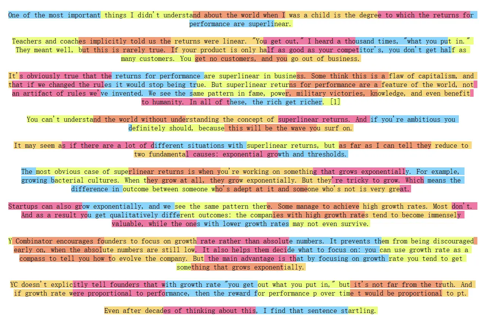

## 1 理解文本分块

将长篇文档切分为更小的单元, 这也是后续向量检索和模型处理的基本单位.

## 2 文档分块的重要性

### 2.1 满足 model 上下文限制

- **Embedding Model**: 将文本向量化, 有严格的输入长度上限.

- **LLM**: 通常比 EM 大得多, 但也有上限.

### 2.2 为何“块”不是越大越好?

并不是的.

#### 2.2.1 Embedding 中的信息损失

大多数 embedding model 基于 transformer, 其大致工作流程如下:

- 分词 (tokenization): 将文本分为一个个 token.

- 向量化 (vectorization): transformer 为每个 token 生成一个高维向量表示.

- 池化 (pooling): 通过某种算法将所有 token 向量压缩为一个单一向量, 用于表示整块的语义.

**压缩**过程中必然伴有信息损失. 文本块越长, 语义点越多, 单一向量所承载的信息就越稀释, 从而导致其愈加笼统, 关键细节被模糊, 从而降低了检索的精度.

#### 2.2.2 生成过程中的“大海捞针” (Lost in the Middle)

研究表明,  当 LLM 处理非常长, 充满大量信息的 context 时, 其更倾向于记住开头和结尾的信息, 忽略中间部份的信息.

如果给 LLM 的 context 又臭又长, 也会导致很难从中提取出最关键的信息, 导致 output 质量的下降或者幻觉.

#### 2.2.3 主题稀释导致检索失败

一个好的块应聚焦于明确, 单一的主题. 若包含太多与主题不相关的内容, 其语义就会被稀释, 导致无法精准检索.

## 3 基础分块策略

下面介绍 LangChain 几种核心的文本分割器 (Text Splitters) 的策略.

### 3.1 固定大小分块

[`CharacterTextSplitter`](./code/01_character_text_splitter.py#L7), 其主要工作步骤:

1. **按段落分割**: 采用默认份分隔符 `\n\n` 使用正则表达式对文本段落进行分割.

2. **智能合并**: 将分割后的段落依次合并, 同时监控监控累计长度, 超过阈值时形成新块, 并通过重叠机制保持上下文连贯性, 在必要时发出超长块警告.

这里并非严格按照固定长度进行分割, 其遵循以下原则:

- 优先保持段落完整性: 当新添加的段落导致总长度超过阈值时, 才结束当前块.

- 处理超长段落: 若单块长度超过阈值时, 会发出警告, 但仍保留该完整块.

该方法的优势在于简单直接, 处理速度快切计算开销小, 劣势在于可能在语义边界处切割, 影响完整性和连贯性. 

通常情况下, 该策略会结合分隔符在段落分界处优先分割, 必要时才能强制按大小切断. 该策略在日志分析, 数据预处理等场景中仍具有应用价值.

### 3.2 递归字符分块

[`RecursiveCharacterTextSplitter`](./code/02_recursive_character_text_splitter.py#L7), 其主要算法流程:

1. **寻找有效分隔符**: 按序从分隔符列表中遍历, 找到第一个在当前文本中存在的分隔符; 如果没有则使用最后一个, 通常是 `""` .

2. **切分与分类处理**: 使用选定的分隔符切分文本, 然后遍历所有片段:

    - 片段不超过阈值, 暂存

    - 片段超过阈值:

        - 将暂存的片段合并

        - 遍历剩余分隔符, 有则分割, 无则直接保留整块

3. **最终处理**: 将剩余的暂存片段合并为最终块.

递归策略能够使用更细粒度的分隔符直到满足大小, 也能一定程度上保留语义程度的完整性.

> 不同的语言其分隔符存在差异, 最好进行相应的配置.

**编程语言支持**:

`RecursiveCharacterTextSplitter.from_language` 提供了对多种编程语言的分割支持.

### 3.3 语义分块

`SemanticChunker` 在语义主题发生显著变化的的地方进行划分:

1. **句子分割** (Stence Splitting): 根据标准分割规则 (如句号, 问号, 感叹号) 将 document 分割为 sentence list.

2. **上下文感知分割** (Context-Aware Embedding): 将 sentence 与其上下的 n 个 sentences 组合进行 embedding.

3. **计算语义距离** (Distance Calculation): 计算相邻 sentences 间的余弦距离.

4. **识别断点** (Breakpoint Identificdation): 分析所有计算出来的距离, 根据一个统计方法确定一个动态阈值, 所有大于该阈值的的点将被识别为“断点”.

5. **合并成块** (Merging into Chunks): 根据所有断点将原始 sentences 序列进行切分后分别合并为 chunks.

#### 断点识别方法

- 百分位法 (percentile): 将所有计算出来的距离值进行排序, 选定某个百分位作为阈值.

- 标准差法 (standard deviation): 计算所有距离的平均值和标准差, 选定 “平均值 + N * 标准差“ 作为阈值 (参考高斯分布).

- 四分位距法 (interquartile): 使用统计学中的四分位距 (IQR), 选定 “Q3 + N * IQR“ 作为阈值.

- 梯度法 (gradient): 计算距离的变化率(梯度), 然后对梯度应用百分位法. 对于句子间语义联系紧密, 差异值普遍较低的文本 (如法律, 医疗等) 很有效.

### 3.4 基于文档结构的分块

对于具有明确结构标记的 document type (如 md, html, latex).

#### 以 markdown 为例

实现原理:

- 定义分割规则: 提供一组标题分隔符与标题层级的映射关系, 比如 `[('#', 'Header 1'), ('##', 'Header 2')]`, 此时 `#` 就是一级 header, `##` 就是二级 header.

- 内容聚合: 遍历所有内容, 以最细粒度 header 为分隔符对文本进行分割得到文本块, 并将映射关系中的 header 信息(关于该文本块的)作为元数据注入到该文本块中.

局限性与组合使用:

- 单纯按照 header 分割可能遇到文本块过长的情况, 通常会再分割完之后, 再使用其他分块器例如 `RecursiveCharacterTextSplitter` 将文本块切分得更小, 这样的同时也能保留原本的元数据信息.

## 4 其他开源框架中的分块策略

### 4.1 Unstructured: 基于文档元素的智能分块

- 分区 (Partitioning): 将原始文档解析成一系列结构化的 elements, 每个 element 都带有语义标签, 如 title, narrative text, list item.

- 分块 (Chunking): 将分区后的 elements 作为输入进行组合:

  - (默认) 连续组合 elements 直到达到 max characters 阈值; 如果单个 element 超过上限才会对其进行分本分割.
  - (可选) 在默认方法的基础上, 将 title 视为新章节的开始, 强制开始新 chunk.

### 4.2 LlamaIndex: 面向节点的解析与转换

将 document 解析为一系列 node, 分块是对 nodes 进行 transformation 的一环.

Node Parser 可分为以下几类:

- 结构感知型: 如 `MarkdownNodeParser`, `JSONNodeParser`, `CodeSplitter`, 按源文档结构进行分割.

- 语义感知型:

  - `SemanticSplitterNodeParser`: 使用 embedding model 检测 sentences 之间的语义断点, 在语义连续性明显减弱的地方分割, 从而让 chunk 内部尽可能连贯.

  - `SentenceWindowNodeParser`: 将 document 拆分为 sentence node, 每个 node 会存储其前后相邻的 n 个 sentences (context); 检索的时候用单个 sentence 进行匹配, 然后将 context text 发送给 LLM.

- 常规型: 如 `TokenTextSplitter`, `SentenceSplitter` 等, 提供基于 token 数量或 sentence 边界的常规切分法.

灵活的流水线操作: 可以使用各个 node parsers 组合成一道流水线进行处理.

良好的互操作性: 使用 `LangchainNodeParser` 可以将任何的 LangChain 的 `TextSplitter` 转换为 node parser.

### 4.3 ChunkViz: 简易的可视化分块工具

开头的图片就是它生成的.

## 参考文献

[Nelson F. Liu, et al. (2023). Lost in the Middle: How Language Models Use Long Contexts. ↩](https://arxiv.org/abs/2307.03172)