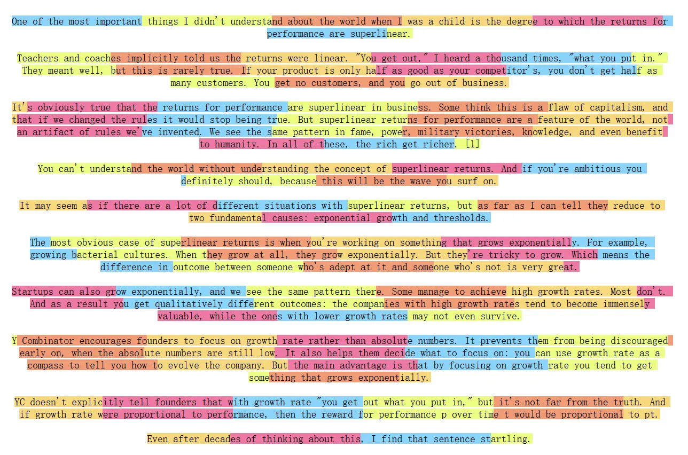

## 1 理解文本分块

将 long document 分割为 smaller units, serve as 后续 vector retrieval 和 LLM processing 的 fundamental units.

## 2 文档分块的重要性

### 2.1 满足模型上下文限制

- **Embedding Model**: 将文本 vectorize, 有严格的 input length limitation.

- **LLM**: 通常比 embedding model 长得多, 但也有 limitation .

### 2.2 为何“块”是不是越大越好?

Not really.

#### 2.2.1 嵌入过程中的信息损失

大多数 embedding model 基于 transformer, 其大致 workflow 如下:

- **Tokenization**: 将文本 split 为一个个 token.

- **Vectorization**: Transformer 为每个 token 生成 a high-dimensional vector representation.

- **Pooling**: 通过某种 algorithm 将所有向量 compresses 为 a single vector, 用于 represent 整个 chunk 的 semantic meaning.

The compression process 必然伴有 information loss. Text chunk 越长, semantic ponits 越多, a single vector 所承载的 info 就越 diluted, 从而导致其愈加 generalized, key details 被 obscured, 从而降低了 retrieval accuracy.

> Chunk 的 vector 是所有 token vectors 的叠加, 必然伴随着 info loss.

#### 2.2.2 生成过程中的“大海捞针” (Lost in the Middle)

研究 indicates: 当 LLM 处理 extremely long context 并且 dense with information, 其 exhibit a tendency to 记住 beginning 和 end 的 info, neglecting 信息 in the middle.

如果给 LLM 的 context 又臭又长, 也会 make it challenging to 从中提取 the most critical info, 导致 answer quality 的 decline, 或者 hallucination 的 increase.

> LLM 的焦点在于 beginning 和 end, 并且过多的 noise 会影响 info 的 extraction.

#### 2.2.3 主题稀释导致检索失败

An effective chunk 应聚焦于 a clear, single subject. 若包含 too much 与 subject 不相关的 content, 其 semantic representation 就会被 diluted, 导致无法精准 retrieve.

> 从更广义的 subject 角度降低 chunk 中的 noise.

## 3 基础分块策略

The following sections 介绍 LangChain 中的 text splitters 所使用的几种 core strategies.

### 3.1 固定大小分块

[`CharacterTextSplitter`](./code/01_character_text_splitter.py#L7), 其 primary workflow:

1. **Split by Paragrah**: 采用 the default delimiter `\n\n`, 使用 regular expression matching 的方式对 document 进行 split .

2. **Intelligent Merging**: Sequentially 合并 split paragraph, during this process 监控 cumulative length, 当其超过 predefined threshold 时 form 一个新 chunk, 并通过 overlap mechanism 保持 context continuity. When necessary 发出 excessively long chunk warning.

该 process 并非严格按照 a rigid, fixed length 进行 split, 其 follows 以下 principles:

- **Prioritize Paragraph Integrity**: 当 add 新 paragrah 时 cause 总长度 exceed 阈值时, 才 finalized 当前 chunk.

- **Handle Long Paragraph**: 若 a single chunk 超过 threshold 时, 会发出 warning, 但仍 preserve 该 complete chunk.

This approach 的 **advantages** 在于 simplicity and efficiency, fast processing speed 且 minal computational cost, **drawbacks** 在于可能在 arbitrary semantic boundaries 处 split, 影响 integrity 和 coherence.

In practice, 该 strategy 会结合 delimiter 在对应的 paragrah breaks 处优先 split, when necessary 才按大小 split. 该 strategy 适用于 log analysis, data preprocessing 等追求 efficiency 的 scenarios.

> 设定固定 length 的盒子, 按照 delimiter 将 paragraph 分割, 随后塞进盒子, 塞不下且必要的时候才 split, 不然也可以硬塞. 简单高效直接.

### 示例代码

[使用 `CharacterTextSplitter` 进行文本分割.](./code/01_character_text_splitter.py#L1)

### 3.2 递归字符分块

[`RecursiveCharacterTextSplitter`](./code/02_recursive_character_text_splitter.py#L7), 其 primary workflow:

1. **Find an Effective Separator**: 按序从 delimiter list 中 iterating, 找到 first 在 current text 中存在的 delimiter; 如果 none 则使用 last delimiter, 通常是 `""` (empty string) .

2. **Split and Categorize**: 使用 chosen 分隔符 split 文本, 然后 iterating 所有 segments:

    - **Segment Under Threshold**: temporarily stored.

    - **Segment Over Threshold**:

        - Merge 所有 stored segments 为 chunk.

        - 遍历 remaining separators, 有则 split, 无则 directly 保留为 chunk.

3. **Final Processing**: 将 remaining stored segments 合并为 a final chunk.

Recursive strategy 能够使用 finer-grained delimiter 直到 meet 大小 constraint, 也能在 some extent 保留 semantic coherence.

> 不同的国家语言其 delimiter 存在差异, 最好进行相应的配置.

> “递归字符分块”看着是针对于“固定大小分块”中“可能在 arbitrary semantic boundaries 进行 split”的 drawback 的一种改进.

### 示例代码

[使用 `RecursiveCharacterTextSplitter` 进行文本分割.](./code/02_recursive_character_text_splitter.py)

**编程语言支持**:

`RecursiveCharacterTextSplitter.from_language` 提供了对多种 program language 的 split 支持.

### 3.3 语义分块

`SemanticChunker` 在 semantic theme 发生 significant change 的 ponits 进行 split:

1. **Stence Splitting**: 根据 standrad split rule (如 periods, question marks and exclamation marks) 将 document 分割为 sentence list.

2. **Context-Aware Embedding**: 将 sentence 与其上下的 n 个 sentences 组合进行 embedding.

3. **Distance Calculation**: 计算相邻 sentences 间的 cosine distance.

4. **Breakpoint Identificdation**: 分析 all computed distances, 根据 a statistical method 确定一个 dynamic threshold, 所有大于 threshold 的 points 将被识别为 breakpoints.

5. **Merging into Chunks**: 根据 all breakpoints 将原始 sentences sequence 进行 split 后, 将各个 part 内的 句子 merge 为 chunks.

> 在结构分割的基础上, 引入了 cosine distance 来计算 semantic breakpoint, 再用 breakpoint 来划分 chunks, 完成从结构划分到语义划分到转换.

#### 断点识别方法

- **百分位法 (Percentile)**: 排序 all computed distance, 选定 a specific percentile 作为 threshold. For example, 默认值为 95th percentile, 这 means 只有 the top 5% 的 points with the most significant semantic differences 被视为 breakpoints.

> 对数据分布没有假设, 只关注排序名次.

- **标准差法 (Standard Deviation)**: Calculate 所有 distances 的 mean 和 deviation, 选定"mean + N (3 by default) * standard deviation" 作为 threshold (参考 Gaussian distribution).

> 适合正态分布, 看看 data 离 mean 有几个 standard deviation; 易被异常值影响.

- **四分位距法 (Interquartile)**: 使用四分位距 (IQR, Interquartile), 选定 “Q3 + N (1.5 by default) * IQR“ 作为 threshold.

> 关注 50% 正常范围内的 data, 看看哪些 data 离这群正常 data 远; 相对稳健, 不怕极值.

- **梯度法 (Gradient)**: 计算 distances 的 rate of change (gradient), 然后对 gradient应用 percentile method. 对于 sentences 之间语义联系紧密, distance 间差值 generally 较低的 text (如 legal or medical document) 是 effective.

### 示例代码

[使用 `SemanticChunker` 进行文本分割.](./code/03_semantic_chunker.py)

### 3.4 基于文档结构的分块

对于具有 explicit structural markers 的 document type (如 md, html, latex).

#### 以 markdown 为例

Implementation Principle:

- **Define Segmentation Rules**: Provide 一组 heading delimiters 与 heading level 的 mapping, 比如 `[('#', 'Header 1'), ('##', 'Header 2')]`, 此时 `#` 就是 level-1 header, `##` 就是 level-2 header.

- **Aggregate Content**: Iterate 所有 content, 以 finest-grained heading 为 delimiter 对 text 进行 split 得到 chunk, 并将 mapping 中的所有 header 信息(关于该 chunk 的) 作为元数据 inject into 该 chunk 中.

Limitation and Combined Usage:

- 单纯按照 header 分割 may 遇到 overly large text chunk 的情况. A common practice 是 spli 之后, 再 apply 其他 chunker 例如 `RecursiveCharacterTextSplitter` 将 chunk 切分得 smaller, 这同时也能 retain 原本的 metadata.

> 标准结构的分割, 并且这假设某些 markers 是有 semantic meaning 的, 因而将 content 其作为 metadata.

## 4 其他开源框架中的分块策略

### 4.1 Unstructured: 基于文档元素的智能分块

- **Partitioning**: 将 raw document 解析成 a sequence of structured elements, 每个 element 都带有 semantic label (e.g. title, narrative text, list item)

- **Chunking**: 将 partitioned elements 作为 input 进行 assembly:

  - Default Method: Sequentially 组合 elements 直到达到 max characters threshold; 如果单个 element 超过 threshold 才会对其 split.

  - Enhanced Option: Building on the default method, 将 title 视为 new chapter/section 的 start, forcing 创建 a new chunk.

> 将 document 解析为 elements, 当然规则在这里没讲, 然后将 elements 组合为 size-constraint chunk.

### 4.2 LlamaIndex: 面向节点的解析与转换

将 document 解析为 a sequence of node, chunking 是对 nodes 进行 transformation 的一环.

Node Parser 可 be categorized as follow:

- **Structure Aware**: 如 `MarkdownNodeParser` , `JSONNodeParser` , `CodeSplitter` , 按 document 的 inherent structure 进行 split.

- **Semantic Aware**:

  - `SemanticSplitterNodeParser`: 使用 embedding model 检测 sentences 之间的 semantic breakpoint 并进行 split, 从而让 chunk 内部 maximally coherent.

  - `SentenceWindowNodeParser`: 将 document 拆分为 individual sentence nodes, 每个 node 会 store 其 preceding and following 的 n 个 sentences (as context); Retrieval 时, 用单个 sentence 进行 matching, 然后将 context 发送给 LLM.

- **General Purpose**: 如 `TokenTextSplitter`, `SentenceSplitter` 等, provide 基于 token counts 或 sentence boundaries 的 standard segmentation.

**Pipeline Flexibility**: Multiple node parsers 可被 chained 为 a processing pipeline.

**Interoperability**: 使用 `LangchainNodeParser` 可将任何的 LangChain 的 `TextSplitter` 转换为 node parser.

### 4.3 ChunkViz: 简易的可视化分块工具

The image at the top 就是它 generated 的.

## 参考文献

[Nelson F. Liu, et al. (2023). Lost in the Middle: How Language Models Use Long Contexts.](https://arxiv.org/abs/2307.03172)