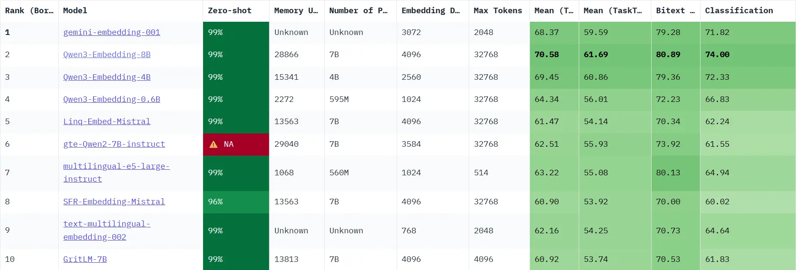
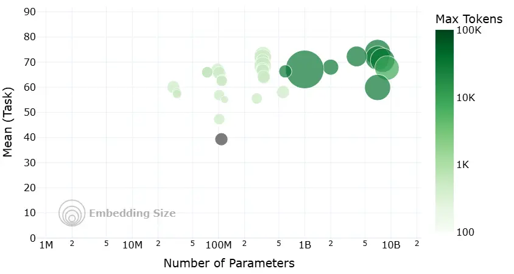

## 1 向量嵌入基础

### 1.1 基础概念

#### 1.1.1 什么是 Embedding

将各种数据对象转换为稠密的连续数值 vector 表示.

从而在一个高维 vector space 中得到一个对象的坐标表示.

向量的维度通常在几百到几千之间.

#### 1.1.2 向量空间的语义表示

Embedding 是对数据语义的编码:

- **核心原则**: 在 vector space 中语义上相似的 object 其空间距离应该是相近的, 反之则更远.

- **关键度量**: 通过以下度量来表示 vector 之间的“距离”或者“相似度”:

  - 余弦相似度 (Cosine Similarity): 计算 vector 间夹角的余弦值, 越接近于 1 代表方向越一致, 语义越相似. (最常用)

  - 点积 (Dot Product): 计算两个向量的乘积和. vector 归一化后, 等价于 cosine similarity.

  - 欧式距离 (Euclidean Distance): 计算 vector 在 space 中的直线 distance, 越小语义越相似.

### 1.2 Embedding 在 RAG 中的作用

#### 1.2.1 语义检索的基础

通用 process 如下:

- **离线索引构建**: document 被 split 后, embedding model 将各个 chunks 转换为 vectors 存入专门的 vector database.

- **相似度计算**: 在 vb 中计算 query vector 与所有 chunk vector 的 similarity.

- **召回上下文**: 选取 similarity 最高的 top-k 个 chunks, 作为补充的 context 与原始 query 一同传给 LLM.

#### 1.2.2 决定检索质量的关键

Embedding 决定了 RAG 检索召回内容的准确性与相关性. 最好能够做到捕捉 query 与 chunks 之间的深层语义联系, 即使 query 与原文的表述并不完全一致; 相反, 如果因为 embbeding 无法理解语义而无法或错误召回则会污染 context.

## Embedding 技术发展

与 NLP 的进步紧密相连, 尤其当 RAG 出现后对其技术要求更高.

### 2.1 静态词嵌入: 上下文无关的表示

- **代表模型**: Word2Vec (2013), GloVe (2014)

- **主要原理**: 为词汇表中的每个 word 生成一个固定的, 与 context 无关的 vector

- **局限性**: 无法处理一词多义问题

### 2.2 动态上下文嵌入

2017 年 Transformer 架构引入 Self-Attention, 允许 model 生成 word vector 时考虑sentence 中其他 words 的影响. 2018 年 BERT 使用 Transformer 的 encoder 通过掩码模型 (MLM) 等自监督任务进行 pre-train, 生成了深度 context 相关的 embedding. 

这意味着一个 word 在不同语境下会生成不同的 vector, 从而解决了一词多义问题.

### 2.3 RAG 对 Embedding 的新要求

- **领域自适应能力**: 通用 embedding model 在特定领域中的表现往往不佳, 这要求 em 能够具备领域自适应的能力, 比如通过微调或使用指令的方式来适应特定领域的术语和语义.

- **多粒度与多模态支持**: 能够处理如长文档, 代码, 图像甚至表格等不同长度和类型的输入数据.

- **检索效率与混合检索**: embedding vector 的维度和 model 的大小直接影响存储成本和检索速度; 同时, 为了结合语义相似性(密集检索)和关键词匹配(稀疏检索)的优点, 支持混合检索的 embedding model 应运而生.

## 3 嵌入模型训练原理

现代 embedding model 的核心通常是 transformer 的 encoder 部份.

### 3.1 主要训练任务

主要是自监督学习的策略, 允许 model 从海量无标注的文本数据中学习知识.

**任务1: 掩码语言模型 (Masked Language Model, MLM)**

过程: 

- 随机将 input sentences 中的 15% 的 tokens 替换为一个特殊的 `[MASK]` 标记.

- 让 model 去预测被遮盖的原始 token 是什么.

目标: 让 model 学习每个 tokens 与其 context 之间的关系, 从而理解深层次的语境语义.

**任务2: 下一句预测 (Next Sentence Prediction, NSP)**

过程:

- 构造训练样本, 每个样本包含 sentence a 和 sentence b.

- 其中 50% 的样本, sentence b 是真实的下一句 (IsNext); 另外 50% 则是从语料库中随机抽取的 (NotNext).

目标: 让 model 学习 sentence 之间的逻辑关系, 连贯性和主题相关性.

重要说明: NSP 在后续研究中被发现可能过于简单, 甚至损坏 model 的性能, 因此很多现代的 embedding model 在 pre-train 阶段移除了 NSP.

> 了解更多细节: [BERT 架构及其应用](https://github.com/datawhalechina/base-llm/blob/main/docs/chapter5/13_Bert.md)

### 3.2 效果增强策略

现代 embedding model 通常会引入更针对性的训练策略以增强在检索任务中的表现.

**度量学习 (Metric Learning)**

- 思想: 直接以 similarity 为优化目标

- 方法: 用大量相关的文本对 (如问题和答案, 标题和正文) 训练以优化 vector space 中的相对距离, 让正例对在 space 中拉近, 负例对推远. 这里并非绝对的相似度, 因为追求极端值可能导致过拟合.

**对比学习 (Contrastive Learning)**

- 思想: 在 vector space 中将相似样本拉近, 不相似样本推远.

- 方法: 构建 3 元组(Anchor, Positive, Negative), 其中 anchor 与 positive 是相关的, 与 negative 是不想关的. 训练的目的是让 distance(anchor, positive) 尽量小, distance(anchor, negative) 尽量大.

## 4 嵌入模型选型指南

### 4.1 从 [MTEB](https://huggingface.co/spaces/mteb/leaderboard) 排行榜开始

MTEB (Massive Text Embedding Benchmark) 是由 Hugging Face 维护的, 全面的 Embedding Model 评测基准. 涵盖了分类, 聚类, 检索, 排序等多种任务.

上图提供了选择开源 Embedding Model 需要权衡的 4 个核心维度:

- 横轴 - 模型参数量 (Number of Parameters): 代表 model 的大小, 越大潜在能力越强, 对计算资源的要求也越高.

- 纵轴 - 平均任务得分 (Mean Task Score): 代表 model 的综合性能, 越大说明 model 在各种 NLP 任务上的平均表现更佳, 通用语义理解能力更强.

- 气泡大小 - 嵌入维度 (Embedding Size): 代表 model 输出 vector 的维度, 越大维度越高, 理论上能编码更丰富的语义细节, 当然也更消耗计算和存储资源.

- 气泡颜色 - 最大处理长度 (Max Tokens): 代表 model 能处理的文本长度上限.

需要注意的是, 榜单上的 score 是在通用数据集上评测的, 可能无法反应在特定业务场景下的表现.

### 4.2 关键评估维度

除了 score 更需关注以下几个维度:

- 任务 (Task): 对于 RAG 更需关注 model 在 retrieval task 下的排名.

- 语言 (Language): 有些 model 并不是所有 language 都支持的.

- 模型大小 (Size): model 越大, 通常性能越好, 推理速度越慢, 性能要求越高.

- 维度 (Dimensions): 维度高, 能编码的信息越丰富, 也占用更多的资源和空间.

- 最大 token 数 (Max Tokens): 决定了 model 能处理的文本长度上限.

- 得分与机构 (Score & Publisher): 考虑 model 的 score 与 publisher 的声誉.

- 成本 (Cost): 调用 api 考虑价格, 自部署考虑硬件资源的消耗和运维成本.

### 4.3 迭代测试与优化

不要只依赖公开榜单.

1. 确定基线 (Baseline): 根据上述维度选择几个作为初始基准 models.

2. 构建私有评测集: 根据真实业务数据, 创建一批高质量的 QA 样本集.

3. 迭代优化: 使用基准 models 在样本集上运行, 进行一定的 RAG 调优, 评估其召回的准确率和相关性, 最后选择最佳的 model.

## 参考文献

[Lewis et al. (2020). Retrieval-Augmented Generation for Knowledge-Intensive NLP Tasks ↩](https://arxiv.org/abs/2005.11401)

[RoBERTa: A Modified BERT Model for NLP ↩](https://www.comet.com/site/blog/roberta-a-modified-bert-model-for-nlp/)