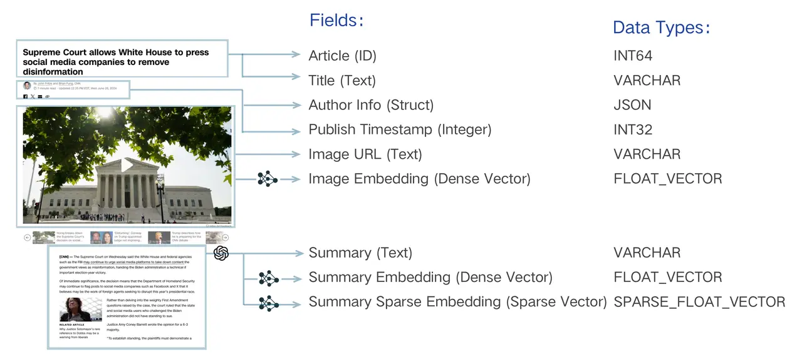

## 1 简介

一个开源的, 专为大规模向量相似性搜索和分析而设计的 vector database.

## 2 部署安装

下面以 Standlone(单机版) 为例.

### 2.1 Docker 安装

略

### 2.2 下载和启动

下载配置文件:

```shell
wget https://github.com/milvus-io/milvus/releases/download/v2.5.14/milvus-standalone-docker-compose.yml -O docker-compose.yml
```

启动:

```shell
docker compose up -d
```

### 2.3 验证安装

```shell
docker ps
```

### 2.4 常用管理命令

停止并移除 container (保留 volumnes):

```shell
docker compose down
```

停止并移除 container (不保留 volumnes, 彻底移除):

```shell
docker compose down -v
```

### 3 核心组件

### 3.1 Collection

最基本的数据组织单位, 所有的 CRUD 都围绕 Collection 展开.

一个 Collection 包含若干个 Partition, 用于将数据隔离以便于检索; Partition 中包含若干个 Entity, 即数据本身.

Schema 定义了 Entity 的结构.

Alias 指向某个具体的 Collection 以便于应用层的调用.

#### 3.1.1 Schema

Schema 定义了 Collection 的 fields 及其属性.

通常包括以下 fields:

- Primary Key Field: 必须有且仅有一个, 作为 Entity 的唯一标识.

- Vector Field: 存储核心 vector 数据, 可以有多个, 以满足多模态场景.

- Scalar Field: 存储 metadata, 用于过滤查询.



#### 3.1.2 Partition

是 Collection 的一个逻辑划分, 默认会有一个 `_default` 分区. 

**为什么使用分区?**

- 提升查询性能: 查询时指定分区, 减少扫描数据量.

- 数据管理: 按需加载指定分区数据, 避免加载全部数据.

一个 Collection 最多有 1024 个 Partition.

#### 3.1.3 Alias

在程序中对 Alias 进行操作, 从而避免直接使用 Collection 名.

**为什么使用 Alias?**

- 安全更新数据: 底层拷贝原 Collection 进行更新, 更新完后原子性切换到新 Collection, 不影响上层应用.

- 代码解耦: 整个切换过程对生层完全透明, 代码无需修改.

### 3.2 Index

Index 本身是一种为加速查询而设计的复杂数据结构, 其极大提升了 similarity 检索速度, 代价便是占用额外的存储和计算资源.


说明:

- Data Structure: Index 的骨架, 定义了 vector 的组织方式.

- Quantization: 数据压缩技术, 降低 vector 的精度以减少存储和计算资源.

- Refiner: 找到初步候选集后, 进行更精确的计算以优化结果.

Milvus 支持 scalar field 和 vector field 分别创建 index:

- scalar field index: 用于加速 metadata 过滤, 通常使用推荐的 index 类型即可.

- vector field index: 核心. 合适的 vector index 是在查询性能, 召回率和内存占用之间做出权衡的艺术.

#### 3.2.1 主要 vector index 类型

以下是几种核心类型:

- FLAT (精确查找)

  - 原理: 暴力搜索 (Brute-force Search), 计算 query vector 与所有 vectors 的实际距离, 返回最精确的结果.

  - 优点: 100% 的召回率.

  - 缺点: 速度慢, 内存占用大, 不适合海量数据.

  - 适用场景: 对精度要求极高, 切数据规模较小(百万级以内).

- IVF 系列 (倒排文件索引)

  - 原理: 先通过聚类将 vectors 分成不同的 buckets, 查询时找到最相似的几个 buckets, 然后只在这几个 buckets 内进行精确搜索. 其有几种不同变体, 主要区别在于是否对桶内向量进行了 quantization.

  - 优点: 缩小 search 范围, 提高 search 速度, 在性能和效果之间取得很好的平衡.

  - 缺点: 非 100% 召回率, 相关 vector 可能被分到未被 search 的 bucket.

  - 适用场景: 通用, 尤其适合高吞吐量的的大规模数据.

- HNSW (基于图的索引)

  - 原理: 构建一层多层的邻近图, 从最上层的稀疏图开始 search, 快速定位到目标区域, 随后在下层的密集图进行精确 search.

  - 优点: 检索速度极快, 召回率高, 尤其擅长处理高维数据和低延迟查询.

  - 缺点: 内存占用非常大, 构建索引时间也较长.

  - 适用场景: 对查询延迟有严格要求.

- DiskANN (基于磁盘的索引)

  - 原理: 一种为在高速磁盘上运行而优化的索引.
  
  - 优点: 支持海量数据集, 同时保持较低的 search 延迟.

  - 缺点: 相比内存索引, 延迟较高.

  - 适用场景: 数据规模巨大, 无法全部加载到内存.


### 3.2.2 如何选择 Index?

需要根据业务场景从数据规模, 内存限制, 查询性能和召回率之间进行权衡.

| 场景| 	推荐索引| 	备注| 
| --- | --- | --- |
| 数据可完全载入内存, 追求低延迟| 	HNSW| 	内存占用较大, 但查询性能和召回率都很优秀. | 
| 数据可完全载入内存, 追求高吞吐| 	IVF_FLAT / IVF_SQ8| 性能和资源消耗的平衡之选. | 
| 数据量巨大, 无法载入内存| 	DiskANN| 	在 SSD 上性能优异, 专为海量数据设计. | 
| 追求 100% 准确率, 数据量不大| 	FLAT| 	暴力搜索, 确保结果最精确. | 

实际上, 往往需要通过 test 来找到适合数据和查询模式的 index 类型及其参数.

## 3.3 Search

### 3.3.1 基础向量检索 (ANN Search)

近似最近邻 (Approximate Nearest Neighbor, ANN) 检索, 利用预先构建的 index, 从数据中找出与 query vecor 最相似的 Top-K 个 vecctor.

该策略在速度和精度之间取得极致平衡.

### 3.3.2 增强检索

在基础 ANN Search 之上提供多种增强检索功能.

**过滤检索 (Filtered Search)**

将 similarity search 与 scalar field search 结合.

- 工作原理: 根据 filter expression 过滤出 entities, 然后再执行 ANN search.

- 应用示例: 

  - 电商: 检索与红色短裙最相似的商品, 但只看价格小于 500 的.
  
  - 知识库: 查找与 AI 相关的文档, 但只从“技术”分类下, 且年份大于 2024 的文章中找.

**范围检索 (Range Search)**

关注所有与 query vector 相似度在特定范围内的 vectors.

- 工作原理: 定义一个阈值范围, 返回 similarity 在该范围内的 entities.

- 应用示例:

  - 人脸识别: 查找与目标人脸相似度超过 0.9 的人脸, 用于身份验证.

  - 异常检测: 查找所有与正常样本 vector 距离过大的点, 用于发现异常.

**多向量混合检索 (Hybrid Search)**

在一个 query 中同时检索多个 vector fields, 并将结果 rerank.

- 工作原理: 

  1. 并行检索: 针对不同的 vector fields 分别发起 ANN search 请求.
  
  2. Rerank: 采用一个 reranker 将不同的 search 结果合并为一个统一的, 更高质量的排序 list.

- 应用示例:

  - 多模态商品检索: query ”安静舒适的白色耳机“, 同时检索商品的文字描述和图片内容 vectors, 返回最匹配的商品.

  - 增强型 RAG: 结合密集向量(捕捉语义)和稀疏向量(匹配关键词), 实现更准确的文档检索.

**分组检索 (Grouping Search)**

解决检索多样性不足的问题.

- 工作原理: 指定一个 field 对结果进行分组, 每个组只返回组内 similarity 最高的 entity.

- 应用示例:

  - 视频检索: 检索“可爱的猫咪”, 确保返回的 vedio 来自不同博主.

  - 文档检索: 检索“AI”, 确保返回的 result 来自不同的书籍.

## 代码示例
