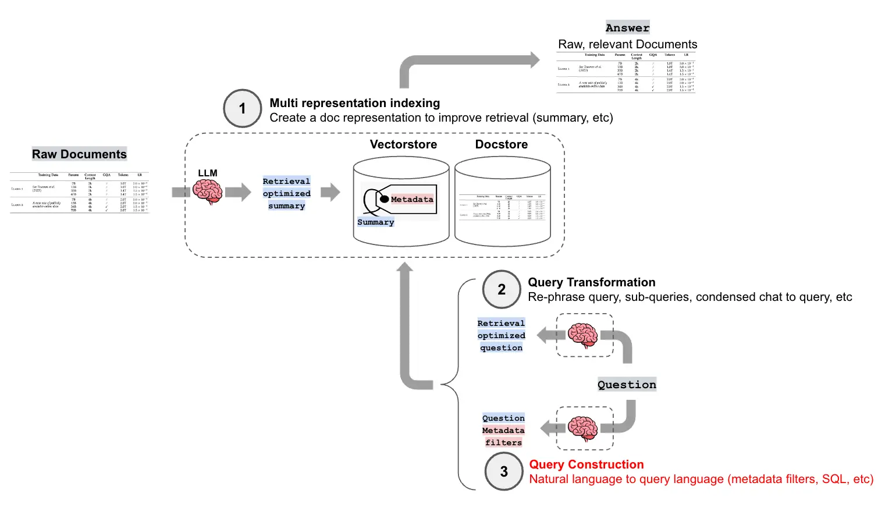

The data source to be processed 是 diverse, 例如 structured data, unstructure data, and graph data. User query 也不 merely 是 simple semantic searches, 往往也包含 complex filter, aggregation 或 relational queries.

Query Construction 利用 LLM 将 user's natural language query 翻译为 specific data source 的 structured query 或者带有 filter condition 的 request.

## 1 文本到元数据过滤器

在 index construction 时常常为 chunk 添加 metadata, 这些 metadata 为 structured fitler 提供了可能.

Self-Query Retriever 是 LangChain 中实现该 function 的 core component, the main workflow:

1. **Define Metadata Schema**: 向 LLM 描述 document content 和 each metadata fields 的 meaning 和 type.

2. **Query Parsing**: 调用 LLM 将 query 分解为 two parts:

    - Query String: 用于进行 semantic retrieval 的 portion.

    - Metadata Filter: LLM 从 query 中提取出 structured filter, 然后通过 translator 转换为 specific vector database 的 native query.

3. **Execute Query**: 同时执行 semantic query 和 filter query.

## 示例代码

[text 转换为元数据 filter](./code/01_text_to_metadata_filter.py)

## 2 文本到 Cypher

THe query construction technique 可 be extended to 更复杂的 data structures, such as graph database.

### 2.1 什么是 Cypher

Cypher 是 graph database (如 Neo4j) 中 the most common query language.

### 2.2 文本到 Cypher 的原理

利用 LLM 将 query 直接 translate 为 a precise Cypher statement.

以 LangChain 中的 `GraphCypherQAChain` 为例, 其 general workflow:

1. Receive 自然语言 query.

2. LLM 根据 pre-supplied graph schema, 将 question 转换为 cypher query.

3. 在 graph database 中执行 cypher query, 获取 structured data.

4. (optional) 将 result 传递给 LLM 生成 answer.

生成 cypher query 较为 complex, 需要 more powerful LLM .

## 参考文献

[LangChain Blog: Query Construction.](https://blog.langchain.ac.cn/query-construction/)
