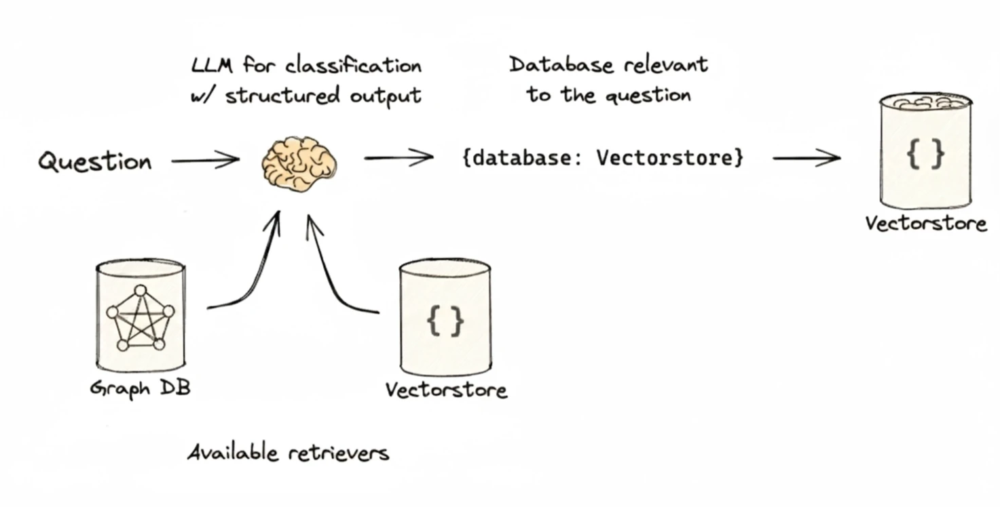

User query 往往是 imprecise, 因而可以对 query 进行 preprocessing, 这就是 query reconstruction and routing.

Primarily 包括 2 key techniques:

1. **Query Translation**: 将 query 转换为 more suitable for retrieval.

2. **Query Routing**: 根据 query 的 characteristics, 将其 distribute 给 a more appropriate data source and retriever.

## 1 查询翻译

弥补 query 与 document 之间的 semantic gap.

### 1.1 提示词工程

通过 prompt 将 query 改写得 more clear, specific, retrieval-friendly format.

### 示例代码

[通过 prompting 改写 query. (对 c4s2 的 improve)](./code/01_text_to_metadata_filter_v2.py)

### 1.2 多查询分解 (Multi-query)

当一个 query 较为 complex 时, 可以将其 decompose 为 multiple sub-query, 然后  separately 进行 retrieve, 最后 aggregate 检索的 results.

### 1.3 退步提示 (Step-Back Prompting)

当面对 a excessively detailed or complex query, LLM 直接回答 is prone to 出错, 这时可以 guide 模型 step-back.

The core workflow:

1. **Abstraction**: 引导 LLM 从 query 中生成 a higher-level, more generalized step-back question. 该 question 旨在探索原始 query 背后 more abstract principles or core concepts.

2. **Reasoning**: 先获取 step-back question 的 answer, 随后将其作为 context 并 along with 原始 query 传递给 LLM.

### 1.4 假设性文档嵌入 (Hypothetical Document Embeddings, HyDE)

HyDE 旨在解决: 用户的 query 往往 short, 关键词有限, 而 docuemnt 又 detailed and rich. 二者在 semantic vector space 中可能存在 gap, 导致 suboptimal retrieval performance.

其 workflow:

1. **Generation**: 调用 LLM 根据 query 生成 a detailed, 可能是 answer 的 docuemnt. 该 document 无需 factually accurate, 但应该是 semantically representative of what a good answer might look like.

2. **Encoding**: 将 generated document 输入给 a contrastive encoder (e.g. Contriever), 将其转化为 high-dimensional vector embedding, 其代表了 an ideal answer 的 latent semantic position.

> 这里需要去理解一下对比编码器, 才知道这里使用它的原因, 简单的说对比编码器关注的是句子维度的 embedding.

3. **Retrieval**: 使用该 document 的 vector 在 db 中 retrieve, 找到 closest real document 作为 context.

Through this process, 将 query 与 document 匹配, 转换为 document 与 document 匹配, 从而 improve 了 retrieval accuracy.

> 上述几种方式本质都是对 query 进行 prompt engineering, 可以从 query 的抽象层的前中后来理解.

## 2 查询路由

当系统 integrated with 多个 data sources 或拥有 diverse processing pipelines, 通过 intelligent routing 替代 hard-coded rules, 将查询 semantically 分发给 the most suitable downstream handler.

### 2.1 应用场景

1. **Data Source Routing**: 根据 query intent 将其 route 到 specific knowledge base.

2. **Component Routing**: 根据 query 的 complexity, 将其 assign 给 specific processing components, 以平衡 cost 和 performance.

3. **Prompt Template Routing**: 根据 query type, 将其分配给 the most effective prompt template, 以优化 answer.

### 2.2 实现方法

有 2 种 predominant approaches.

#### 2.2.1 基于 LLM 的意图识别

设计一个包含 route options 的 prompt, 让 LLM 根据 query 进行 analyzing 并输出 a appropriate designated route option.

#### 示例代码

[菜谱问答, 根据菜系调用不同的专家模型. ](./code/02_llm_based_routing.py)

#### 2.2.2 嵌入相似性路由

通过计算 query 与 pre-configured route exemplars 之间的 similarity 来做出决策.

#### 示例代码

[菜谱问答, 根据菜系调用不同的专家模型. ](./code/03_embedding_based_routing.py)

### 2.3 LlamaIndex 拓展

其 general idea 是将不同的 data source 或 query strategy 包装为 tool, 然后通过 router 进行 dynamically select:

- **LLM-based Intent Classification**: Each tool 包含一个 query engine 和一段 description of its capabilities, router 利用 selector 来让 LLM 根据 user query 与 description 进行 semantic match, 选择对应的 tools.

- **Embedding Similarity Routing**: 没有 provide 基于 similarity 计算的 standalone routing component.

## 参考文献

[How to use the MultiQueryRetriever.](https://docs.langchain.com/oss/python/langchain/overview)

[Zheng, H. S. et al. (2023). Take a Step Back: Evoking Reasoning via Abstraction in Large Language Models.](https://arxiv.org/abs/2310.06117)

[Gao, L. et al. (2022). Precise Zero-Shot Dense Retrieval without Relevance Labels.](https://arxiv.org/abs/2212.10496)

[使用假设性文档嵌入（HyDE）改进信息检索和 RAG.](https://zilliz.com.cn/blog/improve-rag-and-information-retrieval-with-hyde-hypothetical-document-embeddings)

[How to route between sub-chains.](https://docs.langchain.com/oss/python/langchain/overview)

[LangChain Expression Language.](https://docs.langchain.com/oss/python/langchain/overview)

[LlamaIndex Routing.](https://developers.llamaindex.ai/python/framework/module_guides/querying/router/)