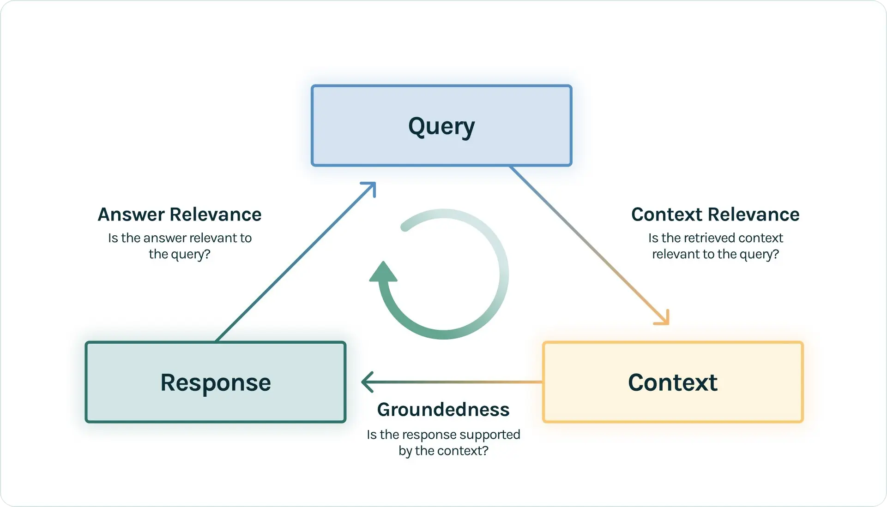

评估回答了 RAG 中的一系列核心问题:

- 对于开发者: 如何量化地跟踪, 迭代并提升 RAG 性能? 结果有问题时如何快速定位?

- 对于用户或决策者: 面对两个不同的 RAG 应用, 如何客观评估其优劣?

本 section 将主要围绕 RAG 三元组 (RAG Triad) 展开:

## 1 RAG Triad

这 3 个维度在 TruLens 等工具中有深入的应用:

1. 上下文相关性 (Context Relevance)

    - 评估目标: Retriever 的性能

    - 核心问题: 检索到的 documents 是否与 query 高度相关?

    - 重要性: document 是后续所有的基础.

2. 忠实度/可信度 (Faithfulness / Groundedness)

    - 评估目标: 生成器的可靠性

    - 核心问题: 生成的 answer 是否完全基于 context?

    - 重要性: 主要在衡量 LLM 的 hallucination 程度.

3. 答案相关性 (Answer Relevance)

    - 评估目标: 系统的端到端 (end-to-end) 的表现

    - 核心问题: 最终生成的 answer 是否直接, 完整且有效回答了 query.

    - 重要性: 这是终端 user 的最直观感受. context relevance 和 groundedness 可以很好, 但 answer 不一定满足 user 的需求.

## 2 评估工作流

实际上评估过程被拆解为了 2 个主要环节: 检索评估和响应评估.

### 2.1 检索评估

聚焦于 Context Relevance, 需要一个标注数据集, 其中包含一系列 query 与其对应的真实相关的 documents.

该评估借鉴了信息检索领域的多个经典指标:

- 上下文准确率 (Context Precision): 衡量检索结果的准确性. 计算检索到的前 k 个 documents 中相关 documents 所占的比例.

- 上下文召回率 (Context Recall): 衡量检索结果的完整性. 计算检索到的前 k 个 documents 中相关 documents 占所有真实相关 documents 的比例.

- F1 分数 (F1-Score): 是 context precision 和 context recall 的调和平均数, 兼顾二者, 寻求平衡.

- 平均倒数排名 (MRR - Mean Reciprocal Rank): 评估第一个相关 document 被排在靠前位置的能力. 对一个 query 而言, 倒数排名是第一个 relevant document 排名的倒数. 而 MRR 是所有 query 的倒数排名的平均值. 该指标适用于只关心第一个正确 anwer 的场景.

- 平均准确率均值 (MAP - Mean Average Precision): 计算每个 query 的平均精确率, 再对所有查询的平均精确率取平均值.

### 2.2 响应评估

覆盖了 Groundedness 和 Answer relevance. 此环节通常采用端到端的评估范式.

#### 2.2.1 主要评估方法

**1 基于 LLM 的评估**

选择一个高性能, 中立的 LLM 作为作为评估者, 该方式正逐渐成为主流:

- Groundedness 评估: 将生成的 answer 分解为一系列独立的声明或者断言 (claims), 然后对每个断言在其 context 中进行验证, 判断真伪. 最后的分数是被 context 证实的 claims 所占的比例.

- Answer Relevance: 同时分析 query 和 answer, 评分时惩罚那些答非所问, 信息不完整或包含过多细节的 answer.

**2 基于词汇量重叠的经典指标**

这类指标需要在 dataset 中包含一个或多个标准答案. 它们通过计算生成答案与标准答案之间 n-gram (连续的 n 个词语) 的重叠程度来评估质量.

- ROUGE (Recall-Oriented Understudy for Gisting Evaluation): 重点关注 recall rate, 即标准 answer 中有多少被生成的 answer 所覆盖, 因此常用语评估完整性.

- BLEU (Bilingual Evalu ation Understudy): 侧重与评估 precision, 衡量生成的 answer 中有多少词是在标准答案中出现过. 还引入长度惩罚机制, 避免生成过短的 sentence. 其更适合评估 answer 的流畅度和准确性.

- METEOR (Metric Evaluation of Translation with Explicit Ordering): BLUE 的改进版, 同考量了精确率和召回率的调和平均, 并通过词干和同义词匹配, 以更高的捕捉语义 similarity. 其评估结合通常被认为与人类的判断的 relevance 更高.

#### 2.2.2 方法对比和总结

基于 LLM 的评估更注重语义和逻辑, 评估质量高, 但成本也高且评估可能存在偏见. 基于词汇重叠的客观, 成本低, 计算快, 但无法理解语义.

实践中可二者结合, 先使用经典指标进行快速, 大规模的初筛, 再利用 LLM 进行更精细的评估.

## 参考文献

[The RAG Triad of Metrics.](https://www.trulens.org/getting_started/core_concepts/rag_triad/)

[如何评估 RAG 应用?](https://zilliz.com.cn/blog/how-to-evaluate-rag-zilliz)