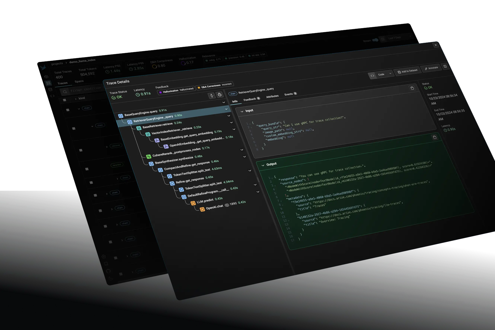

## 1 LlamaIndex Evaluation

深度集成于 LlamaIndex 框架内的评估 module, 其核心定位是为 developer 在开发, 调试和迭代周期中提供快速, 灵活的嵌入式评估解决方案.

### 1.1 核心理念与工作流

利用 LLM, 以自动化的方式对 RAG 系统的各个环节进行打分. 该方法在很多场景下无须预先准备 dataset. 其典型工作流:

- 准备评估数据集: 从 document 中自动生成 question-answer pairs, 或者也可以加载已有的 dataset. 通常会将生成的 dataset 保存到 local 以提高效率.

- 构建查询引擎: 构建若干个需要被评估到 RAG 查询引擎.

- 初始化评估器: 根据评估维度, 选择并初始化若干个评估器.

- 执行批量评估: 使用一个批量评估执行器, 并行地将查询引擎应用于 dataset 中的所有 question, 并调用所有的评估器进行打分.

- 分析结果: 从执行器返回的结果中, 计算各个指标的平均分, 量化对比不同策略的优劣.

### 示例代码

[对比不同的检索策略.](./code/01_llamaindex_evaluation_example.py)

## 2 RAGAS

即 RAG Assessment, 一个独立, 专注于 RAG 的开源评估框架, 主要聚焦于检索和生成 2 个环节. 其最显著的特色是支持无参考评估, 即很多场景下无需人工标注的 standard answer.

### 2.1 设计理念

通过分析 question, answer 和检索到的 context 三者之间的关系, 来综合评估 RAG system 的性能.

### 2.2 工作流程与核心指标

通常遵循以下步骤:

- 准备 dataset: 一个标准的评估 dataset 应包含 question, answer, contexts 以及 ground truth (标准参考答案). ground truth 对于计算 context recall 等指标是必需的, 对于 failthfulness 等指标是可选的.

- 运行评估: 传入准备好的 dataset 和需要评估的指标列表.

- 分析结果: 获取一个包含各项指标量化分数的评估报告.

## 3 Arize Phoenix

一款开源的 LLM 可观测性与评估平台.

### 3.1 核心理念

通过追踪 RAG system 中的每一步调用, 将整个流程可视化.

### 3.2 工作原理

通过基于开放标准 OpenTelemetry 的代码插桩 (Instrumentation), 自动捕获调用, 函数执行等事件; 随后在 execution 的过程中持续生成追踪数据 (traces), 记录完整的执行链路; 随后在本地启动 web ui, 加载这些追踪数据; 最后在 UI 中对失败案例, 表现不佳的 query 进行筛选和钻取, 并借助内置的评估器完成深入的评估与调试.

## 4 对比建议

| 工具 |	核心机制 |	独特技术 |	典型应用场景 |
| --- | --- | --- | --- |
| RAGAS |	LLM驱动评估 |	合成数据生成、无参考评估架构 |	对比不同RAG策略、版本迭代后的性能回归测试 |
| LlamaIndex |	嵌入式评估 |	异步评估引擎、模块化BaseEvaluator |	开发过程中快速验证单个组件或完整管道的效果 |
| Phoenix |	追踪分析型 |	分布式追踪、向量聚类分析算法 |	生产环境监控, Bad Case分析, 数据漂移检测 |

## 参考文献

[LlamaIndex Evaluating.](https://docs.llamaindex.ai/en/stable/module_guides/evaluating/)

[Ragas Docs.](https://docs.ragas.io/en/stable/)

[Arize AI Phoenix.](https://arize.com/docs/phoenix)