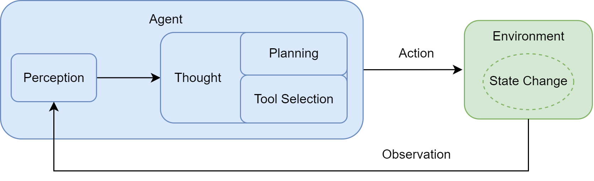

## 1.1 What is an Agent?

Definition within AI: any entity that can perceive its **environment** through **sensors**, and automatically take **actions** through **actuators** to achieve specific goals.

The key here is **autonomy**: ability to make independent decisions based on external perception and internal state, not strictly executing preset instructions.

### 1.1.1 Traditional Agent Perspective

Traditional agents evolved along a path from simple to complex, progressing from passive reaction to active learning.

**Simple Reflex Agent**

The decision-making core consist of pre-defined, explicit "condition-action" rules. It relies entirely on current perceptual input and lacks memory or predictive capbilities.

Example: Automatic thermostat - If the sensor detects a room temperature above the set point, it activates the cooling system.

Key limitation: What if the current environment state is insufficient as the complete basis for a decision?

> Decisions are based solely on pre-defined rules reacting to perception. The agent has no internal state.

**Model-Based Reflex Agent**

Introduce an internal world model, giving the agent "state" or "basic memory".

Example: An autonomous vehicle driving in a tunnel. Even if the camera can't perceive the car ahead, the internal model can still assess that cat's status.

> Translate external perception into internal state.

**Goal-Based Agent**

An agent that proactively and foreseeably chooses actions that lead to a specific future state.

Example: GPS navigation system. The agent, based on an internal map data (world model), uses a search algorithm go plan an optimal route.

Core capability lies in considering and planning for the future.

> This seems distinct from previous agent scenarios.

**Utility-Based Agent**

Associates each state with a utility value indicating satisfaction level; core goal is to maximize expected utility.

Example: GPS navigation system. Determines route to destination optimizing for speed and cost.

> Enables more rational decision-making compared to goal-based agent.

**Learning Agent**

Previous agents rely on pre-defined knowledge; learning agents can autonomously learn through interaction with the environment.

A learning agent consists of:

- **Performance Element**: The actual agent (e.g., reflx, goal-based, utility-based.)

- **Learning Element**: Observes outcomes from the performance element's actions and continuously improves its decision-making strategy.

Representative approach: Reinforcement Learning (RL).

Example: AplhaGo.

### 1.1.2 The New Paradigm Driven by Large Language Models

Comparison between traditional agents and LLM-driven agents:

| Dimension | Traditional Agent | LLM-Driven Agent |
| --- | --- | --- |
| Core Engine | Logic systems based on explicit programming | Inference engine based on pre-trained models |
| Knowledge Source | Pre-defined rules, algorithms, knowledge base by engineers | Learned indirectly and internalized from massive unstructured data |
| Command Handling | Requires structured, precise commands | Can understand high-level, ambiguous natural language |
| Operation Mode | Deterministic, predictable | Probabilistic, generative |
| Generalization/Adapatability | Weak, limited to pre-defined frameworks | Strong, possesses powerful emergent capabilities and generalization |
| Development Paradigm | Rule design, algorithm programming, knowledge engineering | Model training, prompt engineering, fine-tuning |

This difference enables LLMs to handle higher-level, ambiguous and context-rich natural language commands.

> LLMs' powerful generalization capabilities enhance their robustness, making agents more human-like.

### 1.1.3 Agent Types

Classification across 3 complementary dimensions.

**Classification Based on Internal Decision Architecture**

Categories agents according to complexity of internal decision-making strucutre.

- Introduced systematically in *Artificial Intelligence: A Modern Approach*.

- Follow evolutionary path of agent capabilities described earlier.

**Classification Based on Time and Reactivity**

Categories agents based on time considerations in decision-making.

Key trade-off: balacing reactivity vs deliberation.

Generally, more time -> higer quality decision.

- **Reactive Agents**: 

    - Pros: Fast response, low latency, low computational cost.

    - Cons: Short-sighted, no long-term planning, prone to local optima, poor at multi-step complex tasks.

- **Deliberate Agents**:

    - Pros: Use internal world model to expore/evaluate paths for optimal goal achievement.

    - Cons: High time/computation cost, may miss fleeting opportunities.

- **Hybrid Agents**:

    - Balance reactivity and deliberation.

    - Classic layered design: fast reactive module at low level, planing module at high level.

> Current tutorial section is poorly shit - just get the basic concepts.

**Classification Based on Knowledge Representation**

A foundational dimension examining how knowledge is stored in an agent.

- **Symbolic AI**

    - Intelligence arises from logical operation on symbols. Symbols are human-readable entities; operations follow strict logical rules.

    - Pros: Transparent and interpretable; reasoning steps are explicit.

    - Cons: Relies on a complete rule system; struggles with ambiguity, exceptions, and novel situations in the real world - the "knowledge acquisition bottleneck".

- **Sub-symbolic AI**

    - Intelligence emerges from complex neuron-based networks, learning statistical patterns from vast data.

    - Pros: Strong pattern recognition, powerful intuition, robustness to noisy data.

    - Cons: Black-box nature, lack of interpretability, poor perfomance on pure logical reasoning tasks, prone to hallucinations.

- **Neuro-Symbolic AI**

    - Integrates the above 2 approaches.

    - Example: Sub-symbolic AI (e.g., LLMs) can generate sequences of operations for Symbolic AI.

> These dumb theories are really just making trouble for no reason, purely fucking around for a meal.

## 1.2 Agent Composition and Operational Principles

### 1.2.1 Task Environment Definition

Use the PEAS model to describe an agent's task environment, using an "Intelligent Travel Assistant" as an example:

| Dimension | Description |
| --- | --- |
| Performance | Maximize user satisfcation and itinerary feasibility within budget and time constraints |
| Environment | Flight booking websites, mapping services, weather forecast APIs, and other web services |
| Actuators | Functions for calling APIs;  generate and display formatted text to the user interface |
| Sensors | Parse data returned from APIs; read user input in natural language |

In practice, an agent's environment possesses several complex characteristics. First, the environment is typically partially observable, meaning all information cannot be obtained at once. Second, the outcomes of actions are not always predictable due to the environment's deterministic or stochastic nature. Additionally, other actors in the environment can alter ites state at any time.

Finally, nearly all tasks are sequential and dynamic, requiring the agent to adapt quickly and flexibly to a continuously changing environment.                           

### 1.2.2 Agent Operation Mechanism

Interacts with the environment continuously via an Agent Loop process:



The loop consists of the following phases:

- **Perception**: Start of the cycle. Acquires information from the environment via sensors. This can be an initial instruction or an observation resulting from the previous action. 

- **Thought**: An internal reasoning process driven by LLMs. Generally includes:

    - Planning: Based on observations and internal memory, updates the state and develops or modifies an action plan.

    - Tool Selection: According to the plan's requirements, selects the most suitable tool(s) and determines the necessary parameters.

- **Action**: Execute specific actions via actuators. Typically involves calling tools to influence the state of the environment.

The agent progresses toward the goal state through this iterative loop.

### 1.2.3 Agent Perception and Action

Interaction between agent and environment is regulated by a defined interaction protocol.

This protocol typically manifests in the structured output of the agent, consisting of 2 parts:

- Thought: Uses natural language to articulate the reasoning process based on all current information.

- Action: Based on the Thought, specifies the concrete operation to be performed on the environment. Usually takes the form of a fuction call.

Example:

```
Thought: The user want to know the weather in Beijing. I need to call the weather query tool
Action: get_weather("Beijing")
```

An external parser interprets the Action instruction and invokes corresponding function.

The function return a structured result. A sensor converts this result into natural lanuage, forming an Observation for the agent. This initiates a new iteration cycle.

## Example Code

[Construct a simple travel assistant.](./code/main.py)

## 1.3 Collaboration Patterns for Agent Applications

Classification based on the agent's role and level of autonomy in tasks.

### 1.3.1 Agents as Dev Tools

Agents are deeply integrated into developer workflows, enhangcing developer capabilities by automating tedious, repetitive tasks to improve development efficiency and quality.

Examples: Github Copilot, Claude Code, Trae, Cursor.

### 1.3.2 Agents as Autonomous Collaborators

Agents independently complete tasks delegated by the user.

Current mainstream directions include:

1. **Single Agent Autonomous Loop**: A general-purpose agent iteratively executes a "think-plan-act-reflect" cycle, engaging in self-prompting and iteration. (e.g., AgentGPT)

2. **Multi-Agent Collaboration**: 

    - **Role-Playing Dialog**: Two agents are assigned distinct roles They collaborate within a structured dialog by adhering to a predefined communication protocol. (e.g., CAMEL)

    - **Organizational Workflow**: Simulates a virtual team. Each agent has preset responsibilities and SOPs. Collaboration follows a hierarchical or sequential process. (e.g., MetaGPT, CrewAI)

    - **Flexible Dialog Patterns**: Allows devleopers to define complex, custom interaction networks among agents. (e.g., AutoGen, AgentScope)

3. **Advanced Control Flow Architecture**: Modeling the agent's execution process as a state graph, enabling complex workflows with loops, branches, backtracking, and human intervention. (e.g., LangGraph)