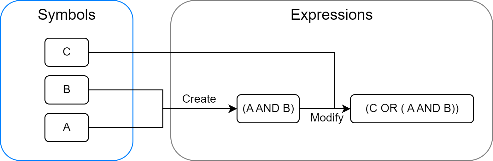
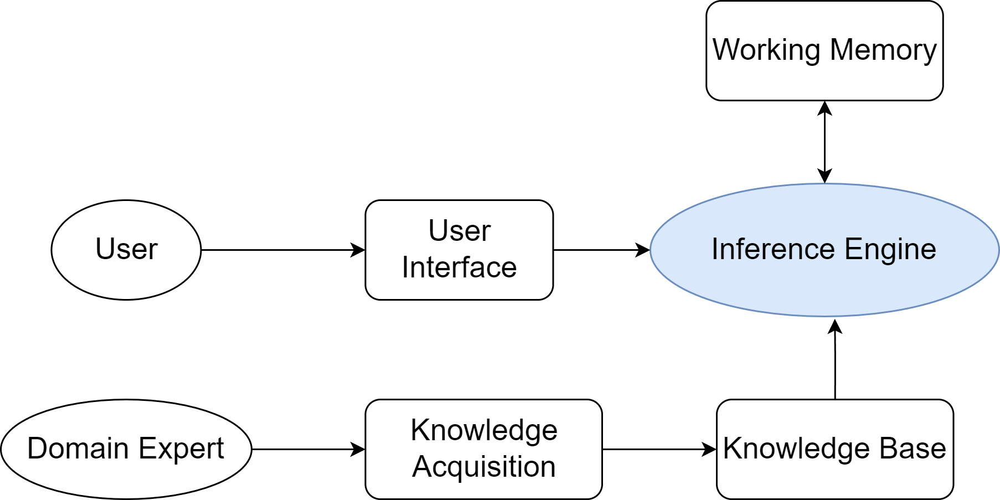
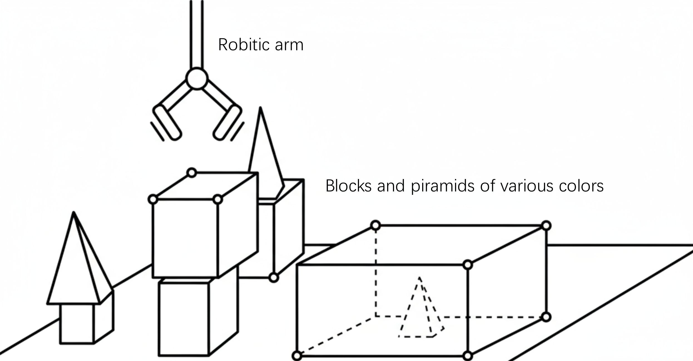
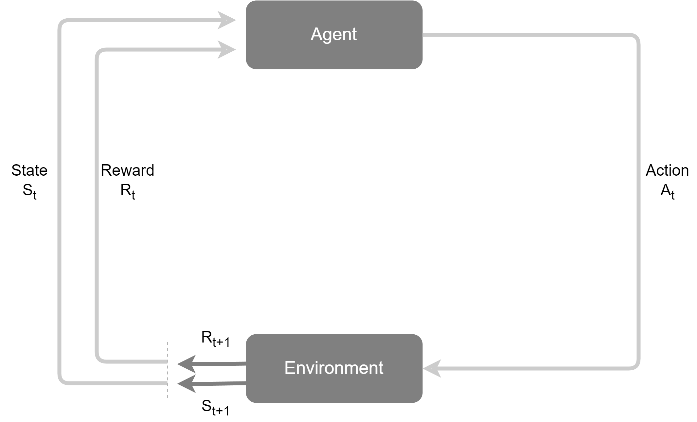
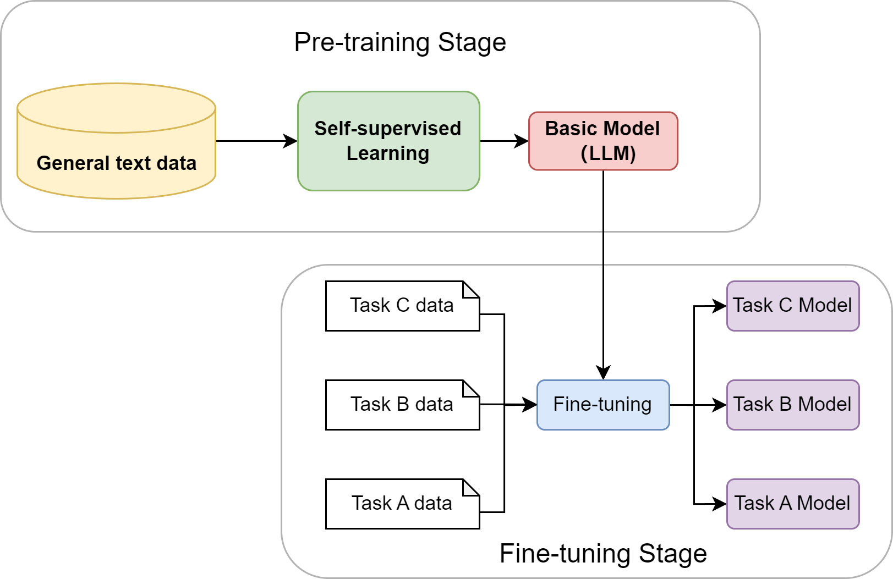
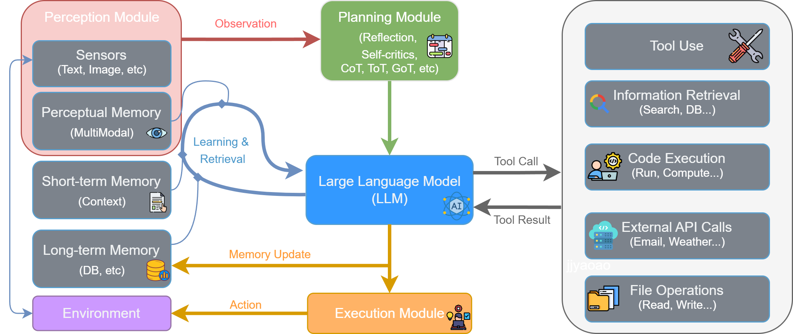
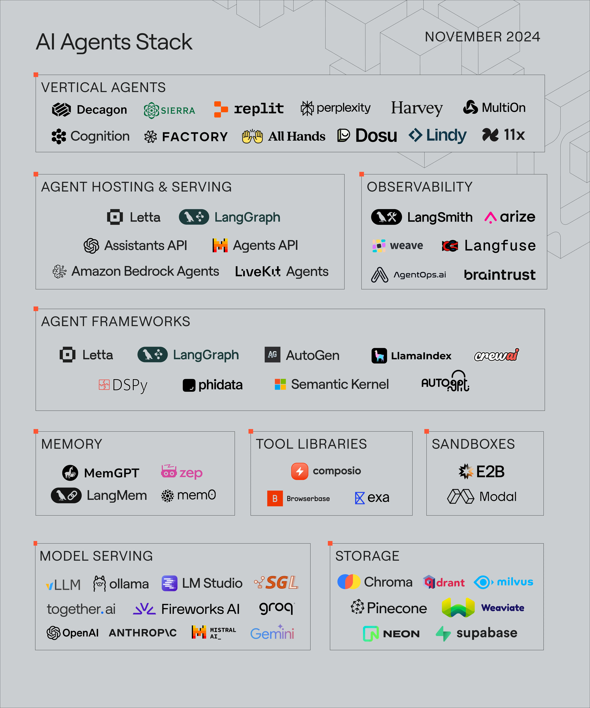

To understand why modern agents take their current form and the origins of their core design philosophies, this section will review their development history.

| Paradigm | Pain Point Addressed | Approach | Limitations |
| --- | --- | --- | --- |
| **Symbolism** | Starting point | Physical symbol system + rule-based reasoning | Knowledge bottleneck + system fragility |
| **Society of Mind** | Difficulty formalizing knowledge, fragile systems | Collaboration of simple agents + emergence | Lack of concrete implementation paths |
| **Learning Paradigm** | Sound theory but lacking realization paths | Neural networks + reinforcement learning | Dependency on massive data + specific corpora |
| **LLM Agents** | Difficulty integrating knowledge & reasoning, adapting to dynamic environment | LLM as core + tool-calling loop | Hallucination + tool dependency |

Each new paradigm emegers to address the core "pain points" or fundamental limitations of the previous paradigm.

## 2.1 Early Agents Based on Symbols and Logic

In Symbolicism, the core of the intelligent behavior is a set of explicit rules that operate on symbols. An agent can be seen as a physical system. It uses internal symbols to represent the external world and employs logical reasoning to plan its actions.

The agent's "intelligence" depends entirely on its pre-coded knowledge base and reasoning rules.

### 2.1.1 Physical Symbol System Hypothesis

This hypothesis consists of two core assertions:

1. **Sufficiency Assertion**: Any physical symbol system possesses the necessary means to produce general intelligent behavior.

2. **Necessity Assertion**: Any system capable of exhibiting general intelligent behavior must, in essense, be a physical symbol system.

A physical symbol system consists of a set of distinguishable symbols and a series of processes that operate on those symbols:

In short: Intelligence is essentially the computation and processing of symbols.

> Combination and reasoning of sufficient and necessary.

### 2.1.2 Expert System

The most representative application of Symbolicism. Expert systems encode an expert's knowledge and experience into a program so that it can provide expert-level answers to similar problems.

General Architecture:

Its intelligence stems from two core components:

- **Knowledge Base**: Stores the domain expert's knowledge and experience. Knowledge Representation is key to building the knowledge base. A commonly used method is Production Rules, which are a series of conditional statements in the form of "IF-THEN".

- **Inference Engine**: Uses given facts to search for relevant rules in the knowledge base and then deduces new conclusions. Its primary working modes are:

    - **Forward Chaining**: Uses facts to continuously match the IF part, triggering the THEN part's conclusion. That conclusion is then used as new fact to search for further conclusions until the final goal is deduced or no new rules match.

    - **Backward Chaining**: Uses goals to continuously match the THEN part, triggering the IF part's facts. Those facts are then used as new goals to search for further facts until all goals can be proven by known facts. 

Example: MYCIN system.

### 2.1.3 SHRDLU

Aimed to build a comprehensive intelligent agent of interacting with humans via natural language withn a micro-scale virtual "blocks world" environment.

It was the first to integrate multiple AI modules into a unified system for cooperative work:

- **Natural Language Understanding**: Could understand not only direct commands but also complex and ambiguous English sentences.

    - **Reference Resolution**: Could interpret references, such as understanding that "the one you are holding” in "Find a block which is taller than the one you are holding and put it into the box" refers to the object currently held by the robotic arm.

    - **Contexual Memory**: After performing "Grasp the pyramid", if asked “What does the box contain?”, the system could relate to context for the answer.

- **Planning and Action**: After understanding an instruction, it autonomously planned a sequence of actions to complete the task.

- **Memory and Response**: Had memory of its environment and its own actions, enabling it to answer questions like:

    - **World State**: "Is there a large block behind a pyramid?"

    - **Action History**: "Did you touch any pyramid before you put the green one on the little cube?"

    - **Action Motivation**: "Why did you pick up the red block?"

Its historical significance and impact are:

- **Paragon of Comprehensive Intelligence**: The first integration of multiple AI modules. Its closed-loop design of "perceive-think-act" laid the fundation for modern agent research.

- **Popularization of the Micro-World Methodology**: Demenstrated the feasibility of exploring and validating fundamental principles of complex agents within a rule-defined, simplified environment.

### 2.1.4 Fundamental Challenges for Symbolicism

As Symbolicism moved from micro-worlds to the open, complex real world, it encountered inherent methodological problems, broadly categorized as:

**Common-Sense Knowledge and the Knowledge Acquisition Bottleneck**

The "intelligence" of symbolic agents relies entirely on the quality and completeness of the knowledge base. However, constructing a knowledge base for real-world interaction proved extremely difficult, evidenced by:

- **Knowledge Acquisition Bottleneck**: The acquisition process involved knowledge engineers interviewing experts, extracting, and coding knowledge. It was costly, time-consuming, and unscalable. Much knowledge is tacit, intuitive, and difficult to express as "IF-THEN" rules. Hand-coding symbolic knowledge of the entire world was unrealistic.

- **Common-sense Problem**: Human knowledge depends on a vast background of common sense, which symbolic systems lack unless explicitly coded. Attempting to build a complete knowledge base for broad, vague common sense was impossible.

**The Frame Problem and System Brittleness**

- **Frame Problem**: In a dynamic world, after an agent executes an action, efficiently determing which things remian unchanged is a logical conundrum.

> Symbolicism is rigorous, execution does not proceed unless conditions are satisfied. 

- **Brittleness**: Any slight variation or situation outside the encoded rules causes the system to fail entirely, lacking flexibility or adaptability.

## 2.2 Build a Rule-Based Chatbot

A hands-on exercise to understand how rule-based systems work.

### 2.2.1 ELIZA Design Philosophy

ELIZA is not a single program but a framework that can run different "scripts". The most famous is the "DOCTOR" script, which mimincs a Rogerian non-directive psychotherapist.

It never directly answers or provides information. Instead, it identifies keywords in user input and applies a set of predefiend transformation rules to turn statements into open-ended questions.

The goal was to demonstrate that with simple sentence transformation tricks, a machine could create an illusion of "intelligence" and "empathy" without understanding the conversation.

### 2.2.2 Pattern Matching & Text Substitution

ELIZA's algorithm, based on Pattern Matching and Text Substitution, follows four clear step:

1. **Keyword Identification & Ranking**: Each keyword in rule set has a priority. The rule associated with the highest-priority keyword is selected for processing.

2. **Decomposition Rule**: Use a decomposition rule with wildcards(*) to capture the rest of the sentence.

    - Rule example: `* my *`

    - User input: `My mother is afraid of me`

    - Capture result: `["", "mother is afraid of me"]`

3. **Pronoun Swap**: Makes the response sound more natural.

    - Example: `me` -> `you`

    - Swapped result: `mother is afraid of you`

4. **Ressembly**: Randomly selects a ressembly template according to the rule to generate a response.

    - Template Example: `Why do you say your []`

    - Output: `Why do you say your mother is afraid of you`

### Example Code

[Mini ELIZA](./code/ELIZA.py)

## 2.3 Marvin Minsky's Society of Mind

The limitation of symbolicism prompted thinkers to reconsider the foundamental philosophy of AI. Marvin Minsky, in *The Society of Mind*, proposed: "What magical trick makes us intelligent? The trick is that there is no trick. The power of intelligence stems from our vast diversity, not from any single, perfect principle.”

### 2.3.1 Reconsidering a Single Unified Model of Intelligence

Marvin Minsky raised a series of foundamental questions:

- **What's "understanding"?**: Is understanding a singular ability? Or is the result of various mental processes - vision, logical reasoning, emotional resonance - working togher?

- **What's "common sense"?**: Is common sense a massive knowledge base containing millions of logical rules? Or is it a distributed network woven from countless specific experiences and fragments of simple rules?

- **How should an intelligent agent be constructed?**: Should we continue pursuing a perfect, unified logical system? Or should we accept that intelligence itself is imperfect, a patchwork composed of many different, even conficting, simple parts?

Marvin Minsky argued that forcing diverse mental activities into a rigid logical framework was inappropriate. He no longer viewed the mind as a pyramid-like hierarchical structure but rather as a flat, interactive and collaborative "society".

### 2.3.2 Intelligence as a Collaborative Entity

In this theoretial framework, an agent refers to an extremely simple, specialized mental process.

These agents are organized to form powerful Agencies capable of accomplishing more complex tasks.

Emergence is the key concept of the Society of Mind. Complex, purposeful intelligent behavior is not pre-planned but spontaneously arises from logical interactions among numerous simple, low-level agents.

Using the task of "building a block tower" as an example, it activate a `BUILD-TOWER` agency:

- The `BUILD-TOWER` agency doesn't know how to perform specific physical actions; its sole function is to activate subordinate agencies, such as `BUILDER`.

- The `BUILDER` agency might contain only a loop logic: while the tower is not cimplete, activate the `ADD-BLOCK` agency.

- The `ADD-BLOCK` agency coordinates more specific subtasks, sequentially activatig sub-agencies like `FIND-BLOCK`, `GET-BLOCK` and `PUT-ON-TOP`.

- Each sub-agency is composed of even low-level agencies. For example, `GET-BLOCK` would activate agents from the visual system (`SEE_SHAPE`) and the motor system (`REACH` and `GRASP`).

Each agency focuses solely on its own function. Through simple activation and inhibition rules, interactions within this society of countless agents can emerge intelligent behavior.

> A clumsy imitation of biology.

### 2.3.3 Theoretical Inspiration for Multi-Agent Systems

The Society of Mind provides an important conceptual foundation for Distributed Artificial Intelligence (DAI) and Multi-Agent System (MAS).

It inspired research in MAS on:

- Decentralized Control: No central controller exists.

- Emergent Computation: Solution to complex problems can spontaneously arise from simple local interaction rules.

- Agent Sociality: Mechanisms for interaction between agents.

## 2.4 Evolution of Learning Paradigms and Modern Agents

If intelligence can't be fully designed, can it be learned?

### 2.4.1 From Symbols to Connections

Unlike top-down Symbolicism, which relies on explicit logical rules, Connectionism is a bottom-top approach inspired by the neural networkds of the brain. Key ideas:

1. **Distributed Representation of Knowledge**: Knowledge is stored across connection weights between simple processing units; the entire network's connectivity encodes knowledge.

2. **Simple Processing Units**: Each unit performs basic mathematical computations.

3. **Weight Adjustment via Learning**: Through exposure to data, connection weights are iteratively adjusted via learning algorithms so network output matches targets.

This approach give agents strong perception and pattern recognition, allowing them to learn directly from raw data.

### 2.4.2 Reinforcement Learning Agents

Connection handles perception; RL focuses on optimal sequential decision-making through interaction. Core RL framework:

1. **Agent**: The learner/decision-maker.

2. **Environment**: Everything the agent interacts with.

3. **State, S**: Description of the environment at a time, basis for decisions.

4. **Action, A**: Operations available to the agent given the current state.

5. **Reward, R**: Scalar signal from environment evaluating the action's quality in that state.

The agent's goal is to maximize cumulative future reward (Return). This requires foresight, sometimes sacrificing immediate reward for greater long-term gain.

### 2.4.3 Pre-training with Large-scale Data

In RL, agents start with no prior knowledge. How can agent begin with broad world understanding? A solution emegered in NLP: pre-training on massive data.

**From Task-Specific to General Models**

Traditional NLP models trained from scratch on small, task-specific datasets let to:

- Narrow knowledge, hard to transfer to new tasks.

- New tasks required new labeled data.

Pre-training + fine-tuning changed this:

- **Pre-training**: Self-supervised learning on vast internet text corpora trains a large neural network.

- **Fine-tuning**: Afer gaining general knowledge, the model adapts to specific tasks with minimal labeled data.

**Large Language Models and Emergent Abilitis**

When model scale passes a threshold, LLMs show emergent abilities like:

1. **In-context Learning**: No weight adjustment needed; few-shot or zero-shot prompts suffice for new tasks.

2. **Chain-of-Thought**: Guiding the model to output step-by-step reasoning before answering improves accuracy on complex problems.

### 2.4.4. LLM-Based Agents

LLMs are a new core paradigm for AI agents.

They understand natural language and can autonomously complete tasks.

### 2.4.5 Overview of Key Developments in Agents

AI history involves interplay, competition, and fusion of core paradigms over half a century. Main schools:

1. **Symbolicism**: Intelligence as symbolic manipulation and logical reasoning.

2. **Connectionism**: Simulation of brain neural networks.

3. **Behaviorism**: Learning optimal strategies through environmental interaction and trial-and-error.

