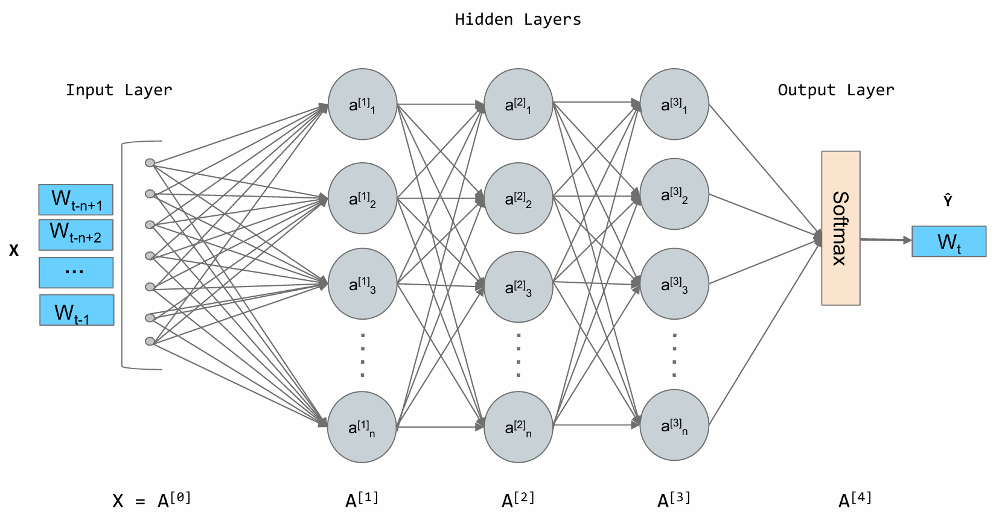
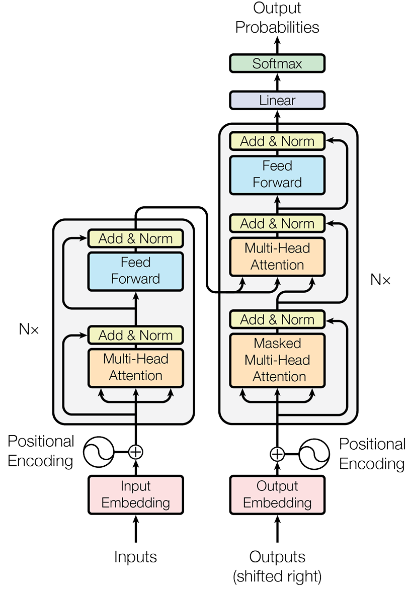
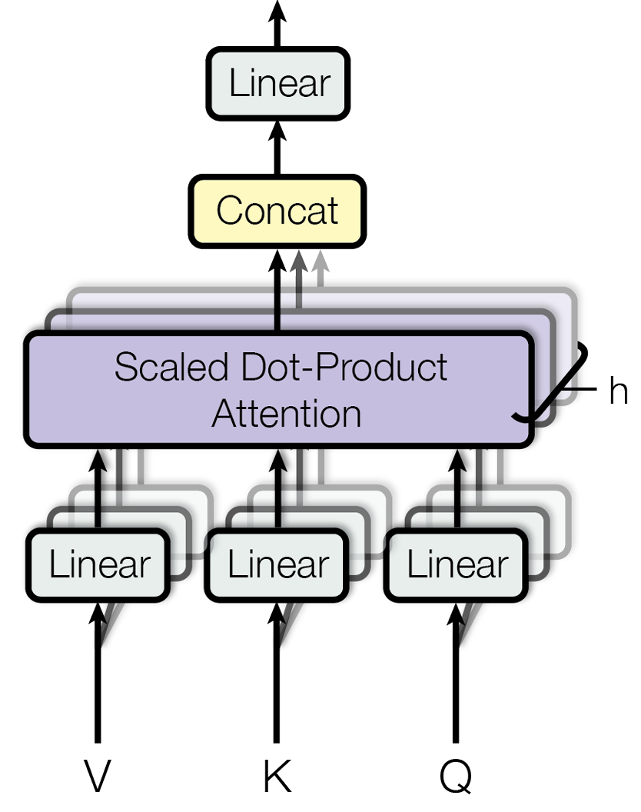
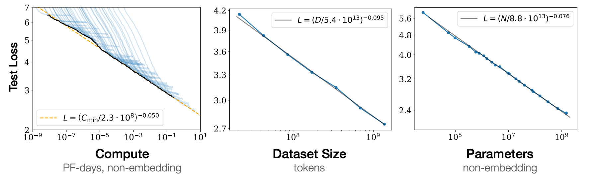

A very basic, surface-level understanding of the mathematical principles of LLMs.

## 3.1 Language Models and the Transformer Architecture

### 3.1.1 From N-gram to RNN

The fundamental task of a language model is to compute the probability of a word sequence (a stence).

**Statistical Language Model and the idea of N-gram**

The probability of a sentence is equal to the product of the conditional probabilities of each word.

For a sentence $S$ composed of words $w_1, w_2, \dots, w_m$, its probability is:

$$
P(S) = P(w_1, w_2, \dots, w_m)
     = P(w_1)\cdot P(w_2 \mid w_1)\cdot P(w_3 \mid w_1, w_2)\cdots P(w_m \mid w_1, \dots, w_{m-1})
$$

This is the chain rule of probability.

Direct calculation is nearly impossible beacuase estimating conditional probabilities like $P(w_m \mid w_1, \dots, w_{m-1})$ from a corpus is difficult; the word sequence might never appear in training data.

Thus, introduce the *Markov Assumption*: a word's probability depends only on a limited $n-1$ preceding words. Language model based on this are **N-gram model**, where N is the context window size. Examples:

- **Bigram (N=2)**: A word depends only on the preceding word: $P(w_i \mid w_1, \ldots, w_{i-1}) \approx P(w_i \mid w_{i-1})$

- **Trigram (N=3)**: A word depends only on the two preceding words: $P(w_i \mid w_1, \ldots, w_{i-1}) \approx P(w_i \mid w_{i-2}, w_{i-1})$

These probabilities can be approximated via **Maximum Likelihood Estimation (MLE)** on a large corpus. For example:

$$
P(w_i \mid w_{i-1}) = \frac{\text{Count}(w_{i-1}, w_i)}{\text{Count}(w_{i-1})}
$$

Where:

- $\text{Count}(w_{i-1}, w_i)$: The number of times the pair $(w_{i-1}, w_i)$ appears.

- $\text{Count}(w_{i-1})$: The total count of word $w_{i-1}$.

N-gram is simple and effective but has two fatal flaws:

- **Sparsity**: If a word sequence never appears, its probability is estimated as 0. **Smoothing** techniques can help but not solve it.

- **Poor Generalization**: Cannot capture semantic similarities between words.

**Neural Network Language Model & Word Embeddings**

Representing words as continuous vectors. The **Feedforword Neural Network Language Model was a milestone.

Core concepts:

1. **Create a semantic space**: Map words to a high-dimensional continuous vector space. Semantically similar words have nearby vectors. This vector is called a **Word Embedding**.

2. **Learn a mapping from context to the next word**: Learn a function. Input: the previous $n-1$ word vectors. Output: a probability distribution over all words in the vocabulary of the next word.

During training, the model adjusts each word's vector position, automatically learning word embedding. Mathematical tools can then measurer relationships between vectors. Most common: **Cosine Similarity**, measure similarity by the cosine of the angle between two vectors.

$$
\text{similarity}(\vec{a}, \vec{b}) = \cos(\theta) = \frac{\vec{a} \cdot \vec{b}}{\|\vec{a}\| \cdot \|\vec{b}\|}
$$

Neural network solved N-gram's poor generalizaiton problem but have the fixed-context-windows limitation.

**RNN and LSTM**

**Recurrent Neural Network(RNN)** introduce a hidden satte vector (short-term memory). At each step of processing a sequence, it combines the previous step's memory to generate a new memory. This allows information to propagate through the sequence.

Major problem: **Long-term Dependency Problem**. During backpropagation through time, gradients are multiplied man times. For long sequences, gradients can vanish (approach zero) or explode (becom extremely large). This makes it hard for the model to learn the influence of early information on later outputs.

**Long Short-Term Memory (LSTM)** networks address this. They introduce a **Cell State** and a **Gating Mechanism** (composed of small neural network). These gates:

- **Forget Gate**: Decides what information to discard from the previous cell state.

- **Input Gate**: Decides what new information from the current intput to store in the cell state.

- **Output Gate**: Decides what information from the cell state to output to the hidden state.

The cell state is a separate information pathway, allowing gradients to flow more easily across many time steps. The gating mechanism learns how to selectively add or remove information, regulating the flow through the cell state.

### Example Code

[Bigram Model Example](./code/bigram.py)

### 3.1.2 Transformer Architecture

Previous sequential processing (RNNs) has a bottleneck: it must process data in order, preventing large-scale computation. The **Transformer** abadons recurrence entirely, relying solely on **Attention** mechanism to capture dependencies within a sequence, enabling parallel processing.

**Overall Encoder-Decoder Structure**

- **Encoder**: "Understands" the input sentence. It reads all input tokens and generates a context-rich vector representation for each token.

- **Decoder**: "Generates" the target sentence. It refers to previously generated tokens and "consults" the encoder's output to produce the next token.

**From Self-Attention to Multi-Head Attention**

Self-Attention allows the model to assign different "attention weights" to all other sequence when processing each token. A higer weight indicates stronger relevance to the current token.

To implement this, each input token vector is assigned 3 learned roles:

- **Query** (Q): Represents the current token being processed.

- **Key** (K): Represents a feature of the token being compared against.

- **Value** (V): Contain the actual information for the feature.

These 3 vectors are derived by multiplying the original word embedding vector by 3 different, learnable weight matrices ($W^Q$, $W^K$, $W^V$):

1. **Initialization**: For each word in the sentence, generate its corresponding $Q$, $K$, $V$ vectors.

2. **Compute Relevance Scores**: Take word $A$'s $Q$ vector and compute the dot product with the $K$ vectors of all words in the sentence (including itself).

3. **Scale & Normalize**: Divide the scores by a scaling factor  $\sqrt{d_k}$ (where $d_k$ is the dimension of $K$ vectors) for gradient stability, then apply a Softmax function to convert scores into weights summing into 1.

4. **Weighted Sum**: Multiply each weight by its corresponding $V$ vector and sum the results to produce the attention vector which is the new context-aware representation of word $A$.

The process is summarized by the formula:

$$
\text{Attention}(Q, K, V) = \text{softmax}\left(\frac{QK^T}{\sqrt{d_k}}\right)V 
$$

Using only a single attention head might foucs on just one type of relationship. **Multi-Head Attention** performs this process multiple times in parallel ("heads"), concatenates the results, and applies a final linear transformation to produce a combined output.

**Feed-Forward Neural Network**

Each Multi-Head Attention sublayer is followed by a **Position-wise Feed-Forward Network (FFN)**. While attention dynamically aggregates relevant information from across the sequence, the FFN extracts higher-order features from this aggragated context.

*Position-wise* means the FFN operates independently and identically on each token position in the sequence. The same set of learned weights is applied to every position.

The structure consists of 2 linear transformations with a $ReLU$ activation in between:

$$
FFN(x) = max(0, xW_1 + b_1)W_2 + b_2
$$

Where:

- $x$ is the output from the attention sublayer.

- $W_1$, $b_1$, $W_2$, $b_2$ are learnable parameters.

Typically, the inner dimension $d_{ff}$ of the first linear layer is much larger than the input/output model dimension $d_{model}$ (e.g., $d_{ff} = 4 \cdot d_{model}$). The $ReLU$ is applied to this expanded representation before the second linear lay projects back to $d_{model}$. This "expand then compress" structure is thought to facilitate learning richer feature representation.

**Residual Connection & Layer Normalization**

Every sub-module (Self-Attention and FNN) is wrapped by an `Add & Norm` operation to stabilize training.

- **Add (Residual Connection)**: The original input $x$ is added directly to the sublayer's output $Sublayer()$. This helps mitigate **vanishing gradient** problem. During backpropagation, gradients can flow directly through this connection, bypassing the sublayer's transformations, enabling effective training of very deep networks.

$$
Output = x + Sublayer(x)
$$

- **Norm (Layer Normalization)**: Normalizes the features of a single sample to have zero mean and unit variance. This combats **internal covariate shift**, ensuring a more stable input distribution for each subsequent layer, which accelerates convergence and improves training stability.

**Positional Encoding**

The attention mechanism is inherently order-agnostic; it has no built-in information about token position/sequence order. Positional encoding are added to the input token embeddings to inject this crucial information.

The core idea is to add fixed vector to each token's embedding that encodes its absolute and relative popsition within the sequence. These vectors are generated using deterministic sinusoidal and cosine functions:

$$
PE_{(pos, 2i)} = \sin\left(\frac{pos}{10000^{2i/d_{model}}}\right)
$$
$$
PE_{(pos, 2i+1)} = \cos\left(\frac{pos}{10000^{2i/d_{model}}}\right)
$$

Where:

- $pos$: Position of token in the sequence.

- $d_{model}$: Dimensionality of the token embeddings (and positional encodings.)

- $i$: Index for a specific dimension within positional encoding vector (ranges from $0$ to $d_{model} / 2$).

### Example Code

[Transformer Example.](./code/transformer.py)

### 3.1.3 Decoder-Only Architecture

OpenAI introduced a simplified approach with GPT: the core task of language modeling is predicting the next most likely token. This led to the removal of the encoder retaining only the decoder.

This architecture operates via an **Autoregressive** process:

1. Provide the model with an initial prompt.

2. The model predicts the next most probable token.

3. Append the newly generated token to the end of the input sequence.

4. Use this updated sequence to predict the next toekn.

5. Repeat until the sequence is complete or a stopping condition is met.

To prevent the decoder from "seeing" future tokens during processing, **Masked Self-Attention** is used. A mask sets attention scores for tokens after the current position to large negative values. After applying softmax, their probabilities become effectively zero, blocking attention to future tokens.

Key advantages:

- **Uniform Training Objective**: Focuses solely on "predicting the next token", ideal for unsupervised pre-training on large text corpa.

- **Simplified Scalable Structure**: Fewer components facilitate easier scaling.

- **Natural Fit for Generation**: Autoregressive nature align perfectly with all generative tasks.

## 3.2 Interacting with Large Models

### 3.2.1 Prompt Engineering

Guide LLMs to produce desired outputs:

**Model Sampling Parameters**

Traditional probability distribution is computed using the Softmax formula:

$$p_i = \frac{e^{z_i}}{\sum_{j=1}^{k} e^{z_j}}$$

Where:

- $z_i$: The model's raw score for the $i$-th item, also called Logits.

- $e^{z_i}$: Scales the raw score via exponential function, ensuring positively.

- $\sum_{j=1}^{k} e^{z_j}$: Sum of scores for all items, the normalization term.

$Temperature$

Introduce a temperature coefficient $T > 0$, rewriting Softmax as:

$$p_i^{(T)} = \frac{e^{{z_i}/{T}}}{\sum_{j=1}^{k} e^{{z_j}/{T}}}$$

When $T$ decreases, distribution becomes sharper, amplifying high-probability item; When $T$ increases, distribution flattens, boosting low-probability items:

- Low Temperature ($0 \le T < 0.3$): Outputs more "precise", "deterministic". Suitable for:

     - Factual Tasks: Q&A, data calculation, code generation.

     - Rigorous Scenarios: Legal interpretation, technical documentation, academic concept explanation.

- Medium Temperature ($0.3 \le T < 0.7$): Outputs "balanced", "natural". Suitable for:

     - Daily Conversation: Customer interaction, chatbots.

     - Routine Creation: Email writing, product copywriting, simple story creation.

- High Temperature ($0.7 \le T < 2$): Outputs "creative", "divergent". Suitable for:

     - Creative Tasks: Poetry writing, sci-fi story, brianstorming, ad slogans, artistic inspiration.

     - Divergent thinking.

$Top-k$

Sort all tokens by probability from high to low, select the top $k$ tokens as candidate set, then normalize probabilities of these $k$ tokens:

$$\hat{p}_i = \frac{p_i}{\sum_{j \in C} p_j}$$

Where $C$ is the candidate set.

$Top-p$

Sort all tokens by probability from high to low, accumulate probabilities starting from the first token until cumulative sum reaches or execeeds threshold:

$$\sum_{i \in S} p(i) \geq p$$

Then normalize tokens in the resulting "nucleus set".

Top-p dynamically adapts to "long-tail" characteristics of different distributions, better handling extreme cases with uneven probability distributions.

Priority order: Temperature -> Top-k -> Top-p. Typically choose either Top-k or Top-p.

**Sample Prompts**

- Zero-shot Prompting

- One-shot Prompting

- Few-shot Prompting.

**Instruction Tuning**

- Use a few examples to instruct the model

- Give direct commands to the model

**Basic Prompting Techniques**

- Role-playing

- In-context Example

**Chain-of-Thought, CoT**

e.g., add “Let's think step by step”.

### 3.2.2 Text Tokenization

Tokenization is the process of converting a text sequence into a numerical sequence. A tokenizer difines a set of rules to split raw text into minimal units called tokens.

**Why tokenization?**

Early tokenization strategies:

- Word-based: Splitting sentences into words using spaces or punctuation. Intuitive but faces challenges:

     - Vocabulary explosion: Language vocabularies are vast.

     - Out-Of-Vocabulary (OOV): Model cannot handle words outside the vocabulary.

     - Missing semantic relationship: Morphologically similar tokens and different forms of the same word are treated as independent tokens.

     - Low-frequency words are difficult to learn adequately.

- Character-based: Splitting text into individual characters. Vocabulary is extremely small and OOV is eliminated, but:

     - Individual characters mostly lack independent semantic meaning.

     - Models spend significant time learning to combine characters to meaningful words, which is inefficient.

Modern approaches commonly use **Subword Tokenization** algorithms: Coomon words are preserved intact, while uncommon words are split into meaningful subword fragments. This controls vocabulary size and allows generating new words by combining subwords.

**Byte-Pair Encoding Algorithm Explained**

BPE is the algorithm used by GPT series. Its core idea can be understood as a "greedy" merging process:

1. Initialization: Initialize the vocabulary with all basic tokens (individual characters) present in the corpus.

2. Iterative Merging: Count the frequency of all adjacent token pairs in the corpus, merge the pair with the highest frequency, add it to the vocabulary, and update the corpus.

3. Repeat step 2 until the vocabulary size reaches a threshold.

Many subsequent algorithms optimize upon this foudation. The 2 most influential are:

- WordPiece: Used by Google's BERT model. It abandons BPE's frequency-only strategy, adopting an optimization criterion based on 'likelihood estimation'. When selecting merge candidates, it measures the mutual information between two tokens: merging occurs only when the ratio $P(AB) / (P(A) \times P(B))$ is maximized.

- SentencePiece: Used by the Llama series models. Its key feature is treating whitespace as a regular character (often represented by an underscore). This makes tokenization and decoding fully reversible and language-independent.

**Sigificance of Tokenizers for Developers**

- **Context Windows Limitation**: Model context windows are measured in tokens, not characters or words. The same text can produce vastly different token counts across languages and tokenizers.

- **API Cost**: Most model APIs charge per token. Understanding the corresponding text tokenization helps estimate and control costs.

- **Model Performance Anomalies**: Sometimes a model's unusual behavior stems from tokenization. For example:

     - "2 + 2" might comput correctly, while "2+2" (without spaces) might fail, as the latter could be treated as a single, uncommon token.

     - A word might be split into completely different token sequences due to capitalization differences.

### Example Code

[BPE Example.](./code/bpe.py)

[Calling Opensource LLM](./code/call_opensource_llm.py)

### 3.2.3 Model Selection

- **Performance & Capabilities**: Different models excel at different tasks. Refer to public benchmarks (e.g., LMSYs Chatbot Arena Leaderboard.)

- **Cost**: Closed-source models incur API call fees. Open-source models involve hardware and operational costs for local delployment.

- **Speed(Latency)**

- **Context Windows**

- **Deployment Method**: API is simple but sends data to third parties. Local deployment requires higher technical and hardware expertise.

- **Ecosystem & Tooling**: Active community and robust toolchain improve development efficiency.

- **Fine-tuning & Customization**: Open-source models offer greater flexibility here.

- **Security & Ethics**: Critical for application handling sensitive information.

## 3.3 Scaling Laws & Limitations of LLMs

### 3.3.1 Scaling Laws

Relathionship between model performance (Loss) and parameters, data size, and compute:

Language modeling performance improves smoothly as we increase the model size, datasetset size, and amount of compute2 used for training. For optimal performance all three factors must be scaled up in tandem. Empirical performance has a power-law relationship with each individual factor when not bottlenecked by the other two.

Early research focused on increasing parameters. The Chinchilla Law revised this: for a given compute budget, an optional ratio exists betwwen model parameters and training data size for peak performance.

The most surprising aspect is "Emergent Abilities". When a model scale crosses a threshold (~billions of paramters), capabilities absent or poor in smaller models suddenly appear. Example: Chain-of-Though, instruction following, multi-step reasoning, code generation.

### 3.3.2 Hallucination

Can be categorized by manifestatio:

- **Factual Hallucinations**: Generating information inconsistent with real-world facts.

- **Faithfulness Hallucinations**: Generated content fails to faithfully reflect the source text's meaning.

- **Intrinsic Hallucinations**: Generated content directly contradicts the input information.

The essence is the model confidently "invents" information rather than accurately retrieving or reasoning.

LLMs also face challenge like outdated knowledge and biases in training data.

Detection and mitigation approaches exist at multiple levels:

- **Data Level**: Address at source via high-quality data cleaning, incorparating factual knowledge, and Reinforcement Learning from Human FeedBack (RLHF).

- **Model Level**: Explore new architectures or enable models to express uncertainty about generated content.

- **Inference & Generation Level**:

     1. RAG

     2. Multi-step Reasoning & Verification: Guide models through multi-step reasoning with self-checking or external verification at each step.

     3. External Tools: Use tools for real-time information or precise calculations.