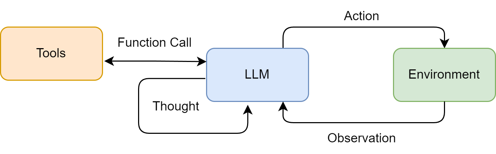
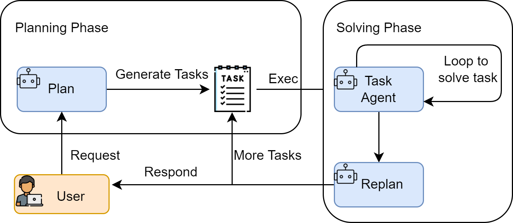
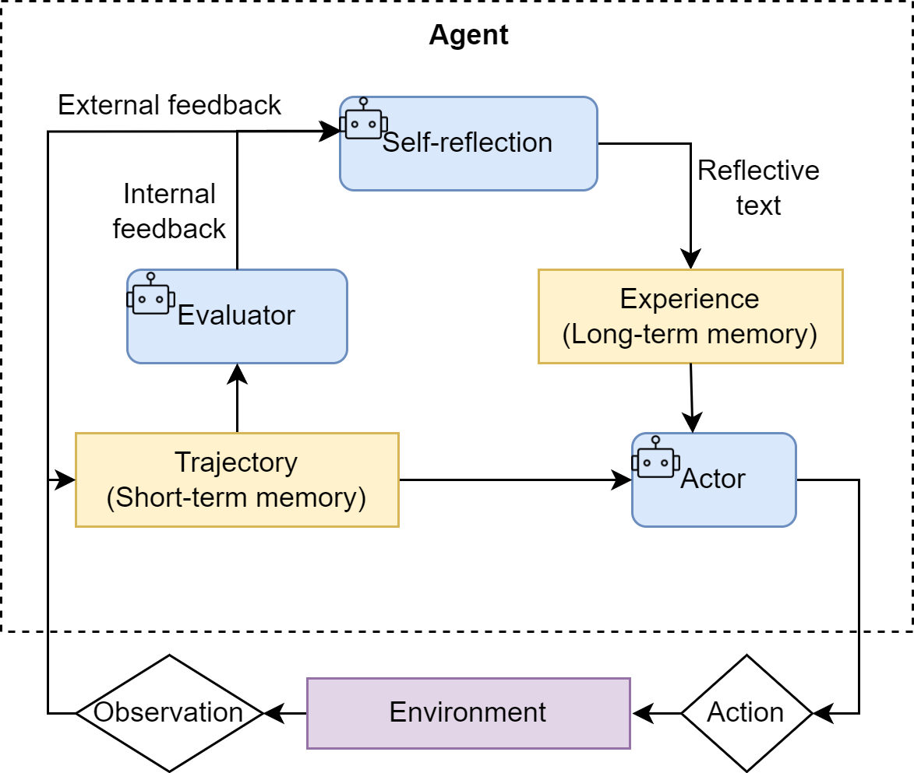

Three representative paradigm for agent "thinking-action" organization:

- **ReAct (Reasoning & Acting)**: Integrates thinking and action closely, allowing the agent to think and act simutaneously, adjusting dynamically.

- **Plan-and-Solve**: Thinking thoroughtly before acting. The agent first generates complete action plan and then executes it strictly.

- **Reflection**: Grants the agent the ability to reflect, optimizing outcomes through self-critique and correction.

## 1.1 ReAct

Reason + Act.

### 1.1.1 Workflow

Initialize observation with the initial question $q$ :

$$o_0 = q$$

At each time step $t = 1,2,\dots$, agent $\pi$ generates current thought $th_t$ and action $a_t$ based on $o_0$ and the history:

$$(th_t, a_t) = \pi\bigl(o_0, (a_1, o_1), \dots, (a_{t-1}, o_{t-1})\bigr)$$

If $a_t$ is a tool call, it is executed by the tool operator $T$, yield a new obeservation:

$$o_t = T(a_t)$$

If the thought indicates that termination conditions are met, i.e, there exists a time step $t^*$ such that:

$$\text{stop}(th_{t^*}) = 1,$$

then at that step, the action directly generates the final answer:

$$r = a_{t^*}$$

Equivalently, the entire process can be viewed as iterative generation of the trajectory:

$$\tau_t = \bigl(o_0, (a_1, o_1), \dots, (a_t, o_t)\bigr),$$

where:

$$
(th_t, a_t) = \pi(\tau_{t-1}),\quad
o_t = 
\begin{cases}
T(a_t), & \text{If not stopped},\\[4pt]
\varnothing, & \text{if }\text{stop}(th_t)=1.
\end{cases}
$$

The process terminates when $\text{stop}(th_t)=1$ is first satisfied and outputs $r = a_t$ as the final answer.

This mechanism is suitable for scenarios requiring:

- External knowledge

- Precise computation

- Interaction with API

### 1.1.2 Tool Definition and Implementation

A tool definition should include three core elements:

- **Name**: A consice, unique identifier called in actions.

- **Description**: Describe the tool's purpose for the LLM to decide on invocation.

- **Execution Logic**: The actual function or method performing the task.

### Example Code

[Definition and implementation of a search tool.](./code/tools.py)

### 1.1.3 Agent Implementation Code

The core lies in the prompt:

- **Role Definition**: Sets the LLM's role.

- **Tool List**: Specifies available tools for the LLM.

- **Format Specification**: Forces structured LLM output.

- **Dynamic Context**: Continuously injects historical interactions into context.

### Example Code

[React Agent Demo.](./code/react.py)

### 1.1.4 Characteristics and Limitations

**Key Characteristics**

- **High Interpretability**: The thought reveals the reasoning process at each step.

- **Dynamic Planing and Error Correction**: Can adjust subsequent thought and action based on obsercation.

- **Tool Coordination**: Naturally combines LLM reasoning with external tool execution.

**Inherent Limitations**

- **Strong Dependency on LLM Capability**: Outcome quality heavily depends on the underlying LLM's overall capability.

- **Execution Efficiency Issues**: May involve multiple LLM calls, each incurring network latency and computational cost.

- **Prompt Fragility**: The entire machanism operates on prompt templates.

- **Potential for Local Optima**: Lack of global or long-term planing; focuses only on immediate observation, potentially choosing paths that seem correct but are suboptimal in the long run.

## 1.2 Plan-and-Solve

Plan first, then solve.

### 1.2.1 Workflow

Core motivation: addresses the tendency of Chain-of-Thought to "go off track" when handling multi-step, complex problems.

Model $\pi$ generates a complete plan $P$ with $n$ steps based on the initial question $q$:

$$P = \pi(q) = (p_1, p_2, \dots, p_n)$$

Then executes each step sequentially. For the $i$-th step, its execution result $s_i$ is generated based on $q$, $P$, and the results of all previous steps:

$$s_i = \pi(q, P, (s_1, \dots, s_i-1))$$

The final answer is the result of the last step $s_n$.

This mechanism is suitable for scenarios requiring:

- Multi-step math word problems.

- Report writing that integrates multiple information sources.

- Code generation tasks.

### 1.2.2 Planning Phase

Use a prompt with:

- **Role Assignment**: Set as a planner-type role. 

- **Task Description**: Define the goal of "decomposing the problem". 

- **Format Constraints**: Structure the output of steps to be executed for easy parsing. 

### 1.2.3 Executor and State Management

The executor is used to complete each task in the plan one by one and manage state. Its prompt should include:

- The original question

- The complete plan

- History of steps and results

- The current step

### Example Code

[Plan-and-Solve Agent Demo.](./code/plan_and_solve.py)

## 1.3 Reflection

Introduce a post-hoc self-correction loop.

### 1.3.1 Core Concept

A three-step cycle: Execution -> Reflection -> Refinement.

In short, model $\pi_{executor}$ generates an initial output $O_0$ based on $Task$:

$$O_0 = \pi_{executor}(Task)$$

For each iterative output $O_i$, the reflection model $\pi_{reflector}$ generates corresponding feedback:

$$F_{i} = \pi_{reflector}(Task, O_i)$$

Subsequently, $\pi_{executor}$ combines the $Task$, $F_i$, and $O_{i}$ to produce a new output:

$$O_{i+1} = \pi_{executor}(Task, O_i, F_i)$$

This pcoess iterates until a stopping condition is met, at which point the corresponding $O_i$ is output.

A memory mechanism is also introduced, enabling the agent to perceive the current state and the evolution of the iterative process.

### Example Code

[Reflection Agent Demo.](./code/reflection.py)

### 1.3.2 Cost-Benefit Analysis

**Primary Costs**:

- Increased model invocation overhead

- Significant increase in task latency

- Increased prompt engineering complexity

**Core Benefits**:

- Leap in solution quality

- Enhanced robustness and reliability

It is particularly well-suited for scenarios where the final result demands high quality, but timeliness is less critical.

