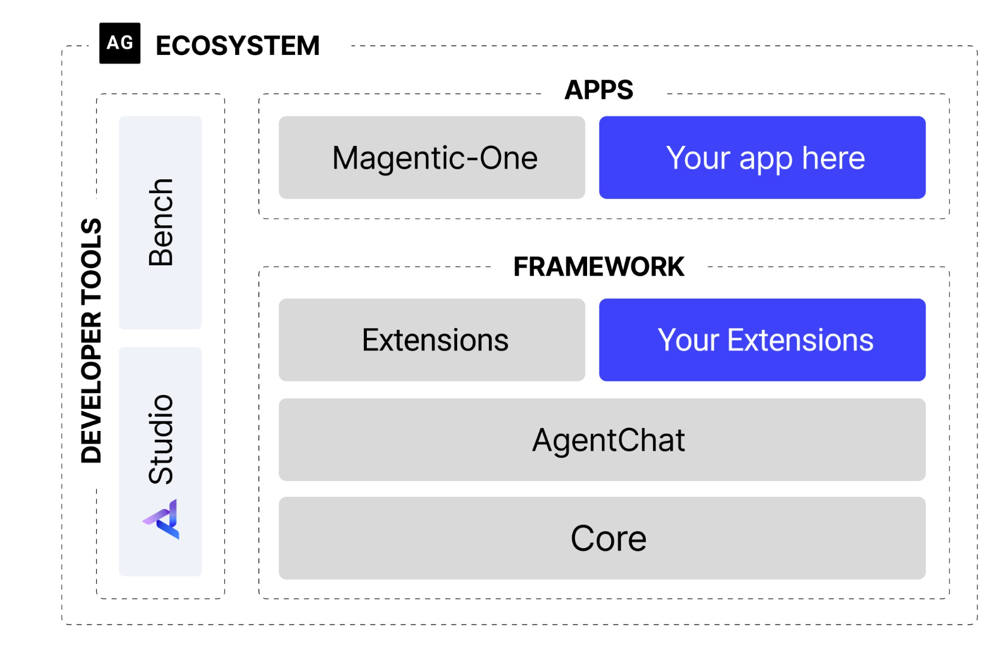

## 3.1 从手动实践到框架开发

### 3.1.1 为何需要智能体框架

- 实现核心组件的解耦与可扩展性:

    - Model Layer

    - Tool Layer

    - Memory Layer

- 标准化复杂的状态管理

- 简化可观测性与调试过程

### 3.1.2 主流框架的选型与对比

新一代的框架主要专注于特定领域的挑战, 特别是 Multi-Agent Collaboration and Complex Workflow Control.

这里聚焦于 4 个具有代表性的框架

- **AutoGen**: 在一个群聊系统中定义多个 agent 角色以及它们之间的交互规则, 通过不断的协作对话完成最终目标.

- **AgentScope**: 特点是易用性和工程化, 非常适合构建运维复杂和大规模的多智能体系统.

- **CAMEL**: 设定两个具有共同目标的不同 agent 角色, 通过相互协作对话完成最终目标.

- **LangGraph**: 将 agent 的执行流程建模为 graph, 每步操作为一个 node, node 之间的跳转逻辑为 edge.

## 3.2 AutoGen

### 3.2.1 核心机制

**框架结构**

- **分层设计**:

    - **Core**: 封装了与 LLM 交互和消息传递等功能.

    - **AgenChat**: 基于 Core 提供开发 agent 的高级接口.

- **异步支持**

**智能体组件**

- `AssistantAgent`: 根据历史对话和预设的角色定义, 生成逻辑性和知识性的对话.

- `UserProxyAgent`: 替 user 发起任务和传达意图, 并担任 executor.

**Team**

群聊概念, 例如 `RoundRobinGroupChat`, 让 agent 按照预定义的顺序依次发言以解决任务.

### Example Code

[软件开发团队模拟](./code/autogen/software_team.py)

## 3.3 AgentScope

和阿里平台深度绑定, 设置了 api key 但是运行不起来, 懒得弄.

## 3.4 CAMEL

### 3.4.1 自主协作

CAMEL 的自主协作机制基于:

**Role-Playing**

设定两个完成共同目标的不同领域 role.

**Inception Prompting**

通过一些约束性 prompt 确保对话不偏离轨迹:

- 明确自身角色

- 告知协作者角色

- 定义共同目标

- 设定行为约束和沟通协议

### Example Code

[电子书撰写模拟](./code/camel/digital_book_writing.py)

## 3.5 LangGraph

### 3.5.1 基本结构

- **全局 State**: 整个 graph 的执行过程都围绕该全局 state 对象进行, 其中可以包含任何想要追踪的信息, 所有节点都能读取和更新其中的信息.

- **Nodes**: 接受 state 作为输入, 并返回更新后的 state.

- **Edges**: 负责连接节点. 有 conditional edges 用于动态决定该跳到哪个 node.

### Example Code

[对话系统模拟](./code/langgraph/dialogue_system.py)